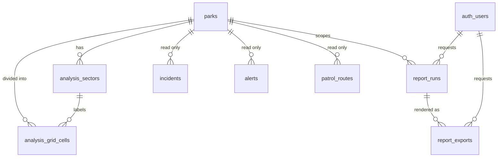
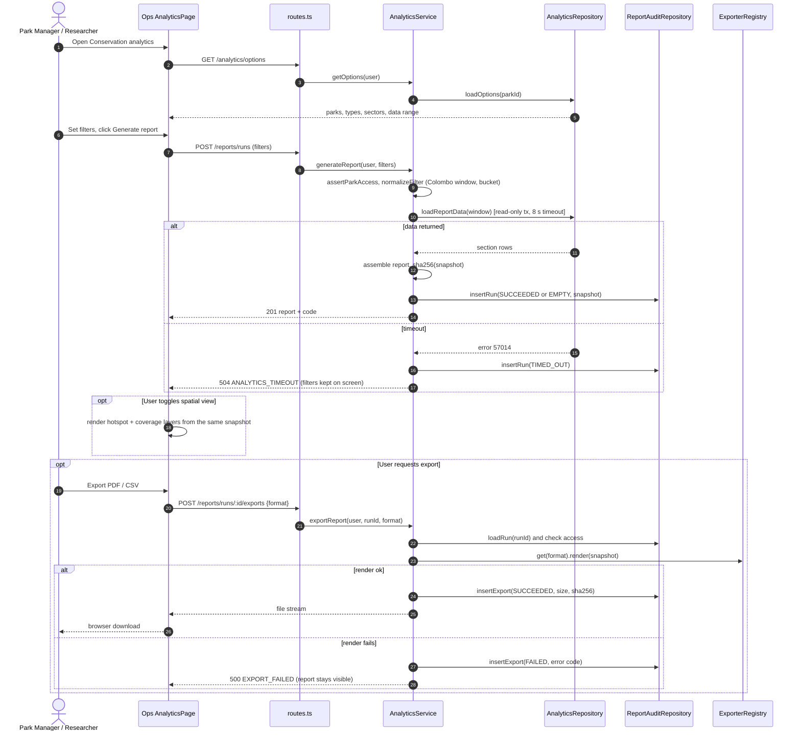

# M4 Implementation Plan — Analyze Conservation Data & Generate Reports

**Project:** Wana Rakshaka — Wildlife Guardian (Group 037, SE3070)
**Use case:** M4 — Analytics and export
**Preserved use case:** Group 039, "Analyze Conservation Data & Generate Reports" (G39 pp. 4–10)
**Owner :** Wenura Kavinda
**Status:** ✅ P0–P8 complete, including P7 isolated spatial/history database checks, safe migration verification, and P8 reduced-motion/browser checks. The Ops bundle-size warning is resolved. P9 coverage/evidence/documentation is next; M4 is not yet complete end to end.
**Supersedes:** the short M4 notes in [Implementation plan §7 M4](./Group037_Implementation_Plan.md#m4-analytics-and-export) and the endpoint rows in its §5. Where this plan is more specific, this plan wins; update those sections to link here.

---

## 0. How to read this plan

| Section    | What it gives you                                                    |
| ---------- | -------------------------------------------------------------------- |
| 1          | Goal, scope and what makes M4 the signature part of the project      |
| 2          | Requirements traced to the case study, Group 039 and our critique    |
| 3          | What exists today, verified against the code and the shared database |
| 4          | Metric dictionary: every number on screen, with its exact definition |
| 5          | Database: new migration, tables, indexes and park configuration      |
| 6          | Shared contracts (Zod)                                               |
| 7          | API: module structure, endpoints, errors and access rules            |
| 8          | Spatial algorithms: hotspots, patrol gaps, boundary conflicts        |
| 9          | Export: PDF and CSV design                                           |
| 10         | Ops UI: routes, pages, sections, components                          |
| 11         | UI design: tokens, layout, charts, map, motion, accessibility        |
| 12         | Third-party libraries: what is reused, added, and rejected           |
| 13         | Code quality: SOLID mapping and design patterns                      |
| 14         | Testing and the >80% coverage plan                                   |
| 15         | Demo data seed                                                       |
| 16         | Build order, delivery tiers and the definition of done               |
| 17         | Risks, decisions and open questions                                  |
| Appendix A | Full flow traceability matrix                                        |
| Appendix B | Edge-case checklist                                                  |

Rules this plan follows, from the assignment and our own plans:

- Preserve Group 039's use case, flows and wireframe layout. Change only with a stated reason tied to a critique ID.
- Extend the existing monorepo. No new app, service, database or package.
- Server-side role, park and privacy checks. The browser is never trusted.
- Every number must have a definition, a test and an honest label.
- Optional extras are marked **Tier 2**. They become report commitments only if implemented and tested.

---

## 1. Goal and scope

### 1.1 One-sentence goal

Give Park Managers and Researchers a trustworthy, filterable picture of **where incidents happen, where rangers have not been, and where human-elephant conflict is building**, and let them export exactly that picture as an official, audited PDF or CSV.

### 1.2 Actors

| Actor                                | Role in M4                                                                                                                                    | Source                                         |
| ------------------------------------ | --------------------------------------------------------------------------------------------------------------------------------------------- | ---------------------------------------------- |
| Park Manager                         | Primary. Full analytics for own park, export, report history for own park                                                                     | G39 p. 4; [User groups §4.2](./User_groups.md) |
| Researcher                           | Primary. Read-only analytics and export for the one park they were granted; sees own report history only; never sees reporter contact details | G39 p. 4; [User groups §4.5](./User_groups.md) |
| Ministry / funding body              | External recipient of exported files. No account, no screens                                                                                  | G39 p. 4; [User groups §5](./User_groups.md)   |
| Ranger, Liaison Officer, Super Admin | No M4 access (Super Admin manages accounts only)                                                                                              | [User groups matrix](./User_groups.md)         |

### 1.3 In scope

1. Filters: park, date range (presets and custom), category group, incident types, report sources, sector.
2. Overview: KPI cards, incident frequency trend, sector incident breakdown table.
3. Spatial view: hotspot grid map, patrol coverage and gap layer, sector outlines.
4. Patrol gaps: gap area, neglected cells, and the **priority cells** list (hotspots rangers have not visited).
5. Human-wildlife conflict trends: community reports and collar geofence breaches as separate series, by month and by boundary stretch.
6. Report generation recorded in an audit log, with a stored snapshot of what was shown.
7. Export of that snapshot to PDF and CSV, each export recorded with format and outcome.
8. Report history page.
9. All G39 exception flows: no records, timeout with filters kept, export failure with the report kept, export skipped.

### 1.4 Out of scope

Predictive modelling, ML hotspot forecasting, scheduled or emailed reports, cross-park national dashboards, live (SSE) analytics refresh, custom dashboard builder, XLSX export. These are listed so the report does not promise them.

### 1.5 What makes M4 the signature part of the project

These five features turn "charts on a page" into a decision tool. Each one is grounded in the case study, not decoration.

| Signature feature                                 | Why it matters                                                                                                                                                                                                           | Case study / G39 link                                                                                                                                                                |
| ------------------------------------------------- | ------------------------------------------------------------------------------------------------------------------------------------------------------------------------------------------------------------------------ | ------------------------------------------------------------------------------------------------------------------------------------------------------------------------------------ |
| **Priority cells — "Where to patrol next"**       | Crosses hotspots with patrol gaps. It lists the grid cells that have repeated incidents _and_ no recent patrol, ranked, with sector name and days since last patrol                                                      | Case study p. 3 ("allocate limited ranger staff to where they're needed most"); G39 storyboard p. 8 ("identify unpatrolled poaching hotspots before assigning weekly ranger shifts") |
| **Audited report snapshot with a reference code** | Every generated report gets a code such as `RPT-YALA-2026-000042` and a stored snapshot. The PDF and CSV are rendered from that snapshot, so the file always matches the screen. Each file carries a SHA-256 fingerprint | G39 postcondition p. 6 ("log of the report query is stored"); critique C9                                                                                                            |
| **Honest data-quality strip**                     | Every view states its sample size and what was excluded: unresolved locations, rejected reports, patrol sessions with no GPS points. This replaces G39's unexplained "Confidence 94.2%"                                  | Our interaction critique ("explain/remove the analytics confidence percentage")                                                                                                      |
| **Source-separated conflict trends**              | Community reports and collar breaches are shown as two series, never summed into one "conflict" number, plus a month × boundary-stretch matrix                                                                           | Implementation plan §7 M4; case study p. 2 ("patterns of conflict along particular boundary stretches")                                                                              |
| **Park-configurable analysis**                    | Grid cell size, track buffer, neglect window and type risk levels come from park configuration. Sinharaja's dense forest uses smaller cells than Yala's grassland, with no code change                                   | Case study p. 2 ("System Flexibility")                                                                                                                                               |

---

## 2. Requirements and traceability

### 2.1 Sources

- **Case study p. 3, "Data Analysis and Reporting":** statistical reports on incidents by type and location over time, on patrol coverage, and on human-wildlife conflict trends. These are used to find poaching hotspots, plan patrol routes, allocate staff and report to funding bodies and ministries.
- **G39 pp. 4–7:** use-case scenario, alternate and exception flows, and the sequence diagram.
- **G39 p. 8:** storyboard. The manager filters by sector, date range and category, then sees patrol gaps and hotspots over the park map.
- **G39 pp. 9–10:** wireframes. The layout we preserve:
  - filter bar with "Generate Report"
  - Tabular / Spatial Heatmap toggle and an index/audit strip
  - three KPI cards: total incidents, high-risk hotspots, patrol gap area
  - incident frequency trend chart and sector incident breakdown table
  - export bar with "Export Data (CSV)" and "Export Official PDF Report"

### 2.2 Group 039 flows and our decisions

| G39 flow                                                                               | Decision                                                                                                                                                                    | Justification                                                                                                                                                          |
| -------------------------------------------------------------------------------------- | --------------------------------------------------------------------------------------------------------------------------------------------------------------------------- | ---------------------------------------------------------------------------------------------------------------------------------------------------------------------- |
| Main: select module, set filters, generate, view stats/charts/tables, export, download | **Retained**                                                                                                                                                                | Core flow                                                                                                                                                              |
| Main step "system prompts the user to set search filters"                              | **Retained, improved:** sensible defaults (own park, last 6 months, all categories) are pre-filled, and the report is not generated until the user clicks "Generate report" | Matches G39 while avoiding an empty first screen                                                                                                                       |
| Alt: visualize spatial heatmap                                                         | **Retained, improved:** a graded grid map instead of a blurred heat layer, with counts, a legend and a table alternative                                                    | Blurred heat layers can't be read precisely, have no accessible alternative and hide the excluded-location count. A grid lines up exactly with the patrol-gap analysis |
| Alt: human-wildlife conflict trends                                                    | **Retained, improved:** a separate conflict view with two source series and a boundary-stretch breakdown                                                                    | Implementation plan §7 M4: show the sources separately so they aren't mistaken for deduplicated real-world conflicts                                                   |
| Alt: export skipped                                                                    | **Retained.** The run is audited with no export                                                                                                                             | Critique C9: download is a conditional postcondition                                                                                                                   |
| Exception: no records found                                                            | **Retained.** Empty state with suggestions to widen the date range or sector; filters stay                                                                                  | G39 p. 6                                                                                                                                                               |
| Exception: data retrieval / server timeout                                             | **Retained.** The query is aborted at 8 s, filters and the previous report stay on screen, and a Retry button is shown; the run is audited as `TIMED_OUT`                   | G39 p. 6                                                                                                                                                               |
| Exception: export generation failure                                                   | **Retained.** Error message, the on-screen report stays intact, the export is audited as `FAILED`, and the user can retry                                                   | G39 p. 7                                                                                                                                                               |
| Postcondition: export "compiled and downloaded"                                        | **Changed to conditional:** "if the user requests an export, a file is compiled and downloaded"                                                                             | Critique C9                                                                                                                                                            |
| Postcondition: query logged in audit history                                           | **Retained, extended:** filters, user, time, outcome, duration and a snapshot fingerprint                                                                                   | G39 p. 6                                                                                                                                                               |
| Sequence: `ConservationReport` created per generation                                  | **Retained:** `report_runs` row with snapshot                                                                                                                               | G39 p. 7                                                                                                                                                               |
| Sequence numbering inconsistency                                                       | **Corrected** in our improved sequence diagram (§7.5)                                                                                                                       | Critique C12                                                                                                                                                           |
| Wireframe "Confidence: 94.2%"                                                          | **Removed.** Replaced by sample size and excluded counts                                                                                                                    | Interaction critique                                                                                                                                                   |
| Wireframe severity column                                                              | **Changed** to "Risk level", derived from incident type through park configuration and labelled as such                                                                     | Incidents have no severity column (§3). Showing a derived value as observed severity would be misleading                                                               |

Appendix A lists the full flow-by-flow traceability with tests.

---

## 3. Verified current state (8 October 2026)

These facts were checked against `main` (`2ff2608`) and the shared Neon database (read-only queries).

### 3.1 Code

| Area                    | Finding                                                                                                                          | Consequence for M4                                                                                           |
| ----------------------- | -------------------------------------------------------------------------------------------------------------------------------- | ------------------------------------------------------------------------------------------------------------ |
| API                     | No `modules/analytics` folder. An earlier prototype (`fbf2892`) was deleted, and its `export_audits` table never had a migration | Build fresh. Don't revive the prototype's `ST_SnapToGrid` in degrees, because degree cells aren't equal-area |
| Ops routing             | No `/analytics` route. `WorkspacePage.tsx` still links to `/analytics` and shows a 404                                           | Add routes; fix the tiles and the page-title map                                                             |
| Ops `DashboardPage.tsx` | Unused placeholder                                                                                                               | Delete it in the M4 PR                                                                                       |
| Charts                  | `recharts ^2.15.4` is installed in Ops but never imported                                                                        | Reuse it; no new chart library                                                                               |
| Maps                    | Leaflet 1.9 and react-leaflet 4 with OSM tiles; no heat plugin                                                                   | Reuse them; render a grid with `Rectangle` and `GeoJSON`                                                     |
| Fetch wrapper           | `api.ts` handles JSON only                                                                                                       | Add a typed blob download helper for exports                                                                 |
| Design systems          | Two exist: the `workspace` system (`styles.css`) and the `m1-*` system (`IncidentFields.css`)                                    | M4 uses one scoped `an-*` layer built on the shared CSS variables (§11)                                      |
| Tests                   | Vitest, Testing Library, `fetch` stubbed with `vi.stubGlobal`; `vitest.m1.config.ts` is the per-use-case coverage template       | Mirror it with `vitest.m4.config.ts`                                                                         |
| DB access               | Raw `postgres` tagged templates; Drizzle files describe the schema only                                                          | Same style; add `drizzle/analytics-schema.ts` for documentation                                              |

### 3.2 Data model gaps

| Gap                                                                    | Effect                                                 | Fix in this plan                                                                                              |
| ---------------------------------------------------------------------- | ------------------------------------------------------ | ------------------------------------------------------------------------------------------------------------- |
| `parks` has no boundary geometry                                       | Patrol-gap area has no denominator                     | `parks.boundary` (MultiPolygon), seeded                                                                       |
| `patrol_routes.target_area` is NULL for every route                    | No per-route target                                    | M4 measures coverage against the park analysis grid instead (§8.2). It doesn't depend on target areas         |
| `patrol_sessions.coverage_percent` is always 0                         | Can't be used                                          | M4 computes coverage from GPS points; it never reads this column                                              |
| `incidents` has no severity                                            | Wireframe severity column has no data                  | Type-based "risk level" from park configuration (§5.4)                                                        |
| `incidents` has no sector, and no GIST index on `location`             | Breakdown by sector needs a spatial join; slow queries | `analysis_sectors` table + GIST index (§5)                                                                    |
| Geofences live in `parks.config.alerts`; `alerts.location` is nullable | Boundary-conflict counts need alert points             | Use `alerts.location`; count NULL locations as excluded                                                       |
| `incident_landmarks` stores lat/lng as doubles                         | Not a problem for M4                                   | M4 reads `incidents.location` only                                                                            |
| Researcher has one `park_id`, not several                              | "Allowed parks" means one park                         | Park selector shows the one allowed park; contract still accepts `parkId` so multi-park access can come later |

### 3.3 Data volume in the shared database

| Table               | Rows today                   |
| ------------------- | ---------------------------- |
| incidents           | 1 (Yala)                     |
| alerts              | 0                            |
| patrol_sessions     | 3 completed                  |
| patrol_gps_points   | 6                            |
| parks with boundary | 0 (column doesn't exist yet) |

**Consequence:** a convincing demo needs the deterministic six-month demo seed in §15. The implementation plan already requires it ("six months of labeled synthetic analytics data").

---

## 4. Metric dictionary

Every metric uses the **filter window** `[from, to]` with these rules:

- **Timezone:** `Asia/Colombo` (UTC+05:30, no daylight saving).
- `from` is inclusive at 00:00:00 Colombo time. `to` is inclusive through 23:59:59.999 Colombo time. In SQL this is a half-open range `[fromStart, toNextDayStart)`.
- **Incident time** is `incidents.captured_at`, when it happened, not when it synced. This keeps offline reports in the correct period.
- **Alert time** is `alerts.created_at`. **Patrol time** is `patrol_gps_points.recorded_at`.
- **Previous period:** the window of the same length that ends just before `from`.
- **Bucket size,** chosen automatically:
  - range ≤ 31 days: day
  - range ≤ 120 days: ISO week, starting Monday 00:00 Colombo
  - otherwise: calendar month
- **Zero-filled buckets:** every bucket is returned, including those with a count of 0 (`generate_series`), so charts never hide gaps.
- **Rejected incidents** are excluded from all metrics by default and counted separately in the data-quality strip. The filter toggle "Include rejected" adds them back.

| ID          | Metric                     | Definition                                                                                                                                                                                                | Shown as                                                               |
| ----------- | -------------------------- | --------------------------------------------------------------------------------------------------------------------------------------------------------------------------------------------------------- | ---------------------------------------------------------------------- |
| K1          | Total incidents            | Count of incidents in park and window matching category, type, source and sector filters; status ≠ REJECTED unless included                                                                               | "42 incidents"                                                         |
| K1Δ         | Change vs previous period  | `(curr − prev) / prev × 100`, rounded to a whole number. prev = 0 and curr > 0 → "New activity"; both 0 → "No change"                                                                                     | "▲ 12% vs previous 180 days" with text, not colour alone               |
| K2          | High-risk hotspots         | Number of grid cells whose incident count is **≥ `hotspotMinCount`** (park config, default 3) **and** in the top 10% of non-empty cells. If fewer than 10 non-empty cells, only the minimum count applies | "3 cells", plus the sector names of the top cells                      |
| K3          | Patrol gap area            | Total area in km² of park grid cells with **no valid patrol track** in the window (§8.2)                                                                                                                  | "18.4 km²", plus the share of the park and the worst sector            |
| K4          | Conflict events            | Two numbers, never summed: community conflict reports and collar geofence breaches                                                                                                                        | "17 community reports · 9 collar breaches"                             |
| K5 (Tier 2) | Median first response      | Median of `first_response_at − reported_at` for incidents with a response; reports n; unanswered incidents listed separately, never averaged in                                                           | "Median 3 h 20 min (n = 21) · 4 awaiting response"                     |
| T1          | Incident frequency trend   | K1 per bucket, zero-filled                                                                                                                                                                                | Bar chart                                                              |
| T2          | Conflict trend             | Community reports and collar breaches per bucket, two series                                                                                                                                              | Grouped bars or two lines                                              |
| B1          | Sector incident breakdown  | Count per incident type × sector, sorted by count. Columns: type, sector, count, risk level, share of total                                                                                               | Paginated table                                                        |
| B2          | Boundary-stretch conflicts | Conflict counts per boundary stretch × source                                                                                                                                                             | Bar chart and matrix                                                   |
| S1          | Hotspot grid               | Count per grid cell (non-empty cells only) with a 5-class colour scale                                                                                                                                    | Map layer                                                              |
| S2          | Coverage grid              | Per cell: covered yes/no, last patrolled time, days since                                                                                                                                                 | Map layer                                                              |
| P1          | Priority cells             | Hotspot cells (K2 rule, relaxed to count ≥ `hotspotMinCount`) that were not patrolled within `gapNeglectDays`. Score = `incidents × min(daysSincePatrol, 90)`; never patrolled = 90. Top 5                | Ranked list "Where to patrol next"                                     |
| Q1          | Excluded: no location      | Incidents in the window with `location IS NULL` or `location_status = 'UNRESOLVED'`. Included in K1 and T1, excluded from S1, K2 and B1's sector column ("Unknown sector" row)                            | Data-quality strip                                                     |
| Q2          | Excluded: rejected         | Rejected incidents in the window                                                                                                                                                                          | Data-quality strip                                                     |
| Q3          | Patrol data quality        | Sessions in the window with fewer than 2 valid GPS points; points dropped by the accuracy or gap rules                                                                                                    | Data-quality strip on the patrol gap page                              |
| Q4          | Outside boundary           | Located incidents outside the park boundary (for example, a village beyond the fence)                                                                                                                     | Counted in K1; shown on the map; excluded from cell counts with a note |

### 4.1 Category groups

The G39 filter "Poaching & Snares" is a group, not a single type. Groups are defined once in `@wr/shared`:

| Group                     | Incident types                                     | Conflict view also counts       |
| ------------------------- | -------------------------------------------------- | ------------------------------- |
| `ALL`                     | all                                                | —                               |
| `POACHING_AND_SNARES`     | POACHING, SNARE_FOUND                              | —                               |
| `HUMAN_WILDLIFE_CONFLICT` | HUMAN_WILDLIFE_CONFLICT, CROP_DAMAGE, FENCE_DAMAGE | collar `GEOFENCE_BREACH` alerts |
| `ANIMAL_WELFARE`          | INJURED_ANIMAL                                     | —                               |
| `OTHER`                   | OTHER                                              | —                               |

A **conflict report** (K4, T2, B2) is an incident with source `COMMUNITY` and a type in the HWC group. Ranger-reported HWC incidents count in the incident metrics, and appear as an optional third series "Ranger-reported conflict" in the conflict view, never merged.

---

## 5. Database design

### 5.1 New migration `apps/api/drizzle/0009_analytics.sql`

`0009` is the next free number. Write it to be idempotent and safe to re-run; CI runs migrations twice. Coordinate the number with the team before merging, because two people picking `0009` would collide in review.

```sql
-- 0009_analytics.sql — M4 analytics and export. Idempotent.

-- 1. Park boundary: the denominator for patrol-gap area.
ALTER TABLE parks ADD COLUMN IF NOT EXISTS boundary geometry(MultiPolygon, 4326);
CREATE INDEX IF NOT EXISTS parks_boundary_gix ON parks USING GIST (boundary);

-- 2. Named analysis areas: interior sectors and boundary stretches.
CREATE TABLE IF NOT EXISTS analysis_sectors (
  id          uuid PRIMARY KEY DEFAULT gen_random_uuid(),
  park_id     uuid NOT NULL REFERENCES parks(id) ON DELETE RESTRICT,
  code        varchar(32)  NOT NULL CHECK (code ~ '^[A-Z][A-Z0-9_]*$'),
  name        varchar(120) NOT NULL,
  kind        text NOT NULL CHECK (kind IN ('SECTOR', 'BOUNDARY_STRETCH')),
  area        geometry(MultiPolygon, 4326) NOT NULL,
  created_at  timestamptz NOT NULL DEFAULT now(),
  UNIQUE (park_id, code)
);
CREATE INDEX IF NOT EXISTS analysis_sectors_park_kind_idx ON analysis_sectors (park_id, kind);
CREATE INDEX IF NOT EXISTS analysis_sectors_area_gix ON analysis_sectors USING GIST (area);

-- 3. Precomputed equal-area grid per park (metric, UTM 44N = EPSG:32644).
CREATE TABLE IF NOT EXISTS analysis_grid_cells (
  park_id      uuid NOT NULL REFERENCES parks(id) ON DELETE CASCADE,
  cell_size_m  integer NOT NULL CHECK (cell_size_m BETWEEN 250 AND 5000),
  col          integer NOT NULL,
  row          integer NOT NULL,
  sector_id    uuid REFERENCES analysis_sectors(id) ON DELETE SET NULL,
  geom         geometry(Polygon, 4326)  NOT NULL,   -- clipped to the boundary, for the map
  geom_m       geometry(Polygon, 32644) NOT NULL,   -- metric, for area and buffering
  area_m2      double precision NOT NULL CHECK (area_m2 > 0),
  PRIMARY KEY (park_id, cell_size_m, col, row)
);
CREATE INDEX IF NOT EXISTS analysis_grid_cells_geom_gix   ON analysis_grid_cells USING GIST (geom);
CREATE INDEX IF NOT EXISTS analysis_grid_cells_geom_m_gix ON analysis_grid_cells USING GIST (geom_m);

-- 4. Report runs: the audit log and the snapshot each export is rendered from.
CREATE SEQUENCE IF NOT EXISTS report_run_number_seq;
CREATE TABLE IF NOT EXISTS report_runs (
  id               uuid PRIMARY KEY DEFAULT gen_random_uuid(),
  code             varchar(40) NOT NULL UNIQUE,          -- RPT-YALA-2026-000042
  park_id          uuid NOT NULL REFERENCES parks(id) ON DELETE RESTRICT,
  requested_by     uuid NOT NULL REFERENCES auth_users(id) ON DELETE RESTRICT,
  requester_role   text NOT NULL,
  filters          jsonb NOT NULL,                       -- normalized AnalyticsFilter
  status           text NOT NULL CHECK (status IN ('SUCCEEDED', 'EMPTY', 'TIMED_OUT', 'FAILED')),
  snapshot         jsonb,                                -- ConservationReport; NULL unless SUCCEEDED
  snapshot_sha256  char(64),
  duration_ms      integer NOT NULL CHECK (duration_ms >= 0),
  error_code       text,
  created_at       timestamptz NOT NULL DEFAULT now(),
  CHECK ((status = 'SUCCEEDED') = (snapshot IS NOT NULL AND snapshot_sha256 IS NOT NULL))
);
CREATE INDEX IF NOT EXISTS report_runs_park_created_idx ON report_runs (park_id, created_at DESC);
CREATE INDEX IF NOT EXISTS report_runs_user_created_idx ON report_runs (requested_by, created_at DESC);

-- 5. Exports: one row per attempt, including failures.
CREATE TABLE IF NOT EXISTS report_exports (
  id            uuid PRIMARY KEY DEFAULT gen_random_uuid(),
  run_id        uuid NOT NULL REFERENCES report_runs(id) ON DELETE RESTRICT,
  requested_by  uuid NOT NULL REFERENCES auth_users(id) ON DELETE RESTRICT,
  format        text NOT NULL CHECK (format IN ('PDF', 'CSV')),
  status        text NOT NULL CHECK (status IN ('SUCCEEDED', 'FAILED')),
  byte_size     integer CHECK (byte_size IS NULL OR byte_size > 0),
  file_sha256   char(64),
  error_code    text,
  created_at    timestamptz NOT NULL DEFAULT now(),
  CHECK ((status = 'SUCCEEDED') = (byte_size IS NOT NULL AND file_sha256 IS NOT NULL))
);
CREATE INDEX IF NOT EXISTS report_exports_run_idx ON report_exports (run_id, created_at DESC);

-- 6. Read-path indexes on other modules' tables (additive only).
CREATE INDEX IF NOT EXISTS incidents_park_captured_idx ON incidents (park_id, captured_at);
CREATE INDEX IF NOT EXISTS incidents_location_gix      ON incidents USING GIST (location);
CREATE INDEX IF NOT EXISTS alerts_park_type_created_idx ON alerts (park_id, type, created_at);
```

**Why each table exists:**

- `analysis_sectors` gives the wireframe's "Location sector" column and the case study's "boundary stretches" real geometry. It is separate from `patrol_routes.sector`, which is free text owned by M2. Route sector names are reused as sector names in the seed so the two match.
- `analysis_grid_cells` is precomputed once per park and cell size, so analytics never rebuilds a grid inside a time-critical query. It is regenerated by the seed or by an admin script when the boundary or cell size changes.
- `report_runs` and `report_exports` are append-only. The application never runs `UPDATE` or `DELETE` on them. They implement the G39 audit postcondition and the implementation plan's `report_audit` entity.

Ownership rule: `0009` only **adds** indexes to M1/M3 tables. It never changes their columns or constraints.

Also add `apps/api/drizzle/analytics-schema.ts` describing these tables (documentation, matching the existing pattern), and update `drizzle/README.md`.

### 5.2 Entity relationships



### 5.3 What M4 reads from other modules (read-only)

| Owner  | Table                                                                 | Columns used                                                                                                           |
| ------ | --------------------------------------------------------------------- | ---------------------------------------------------------------------------------------------------------------------- |
| M1     | incidents                                                             | id, park_id, type, source, status, location, location_status, captured_at, reported_at, first_response_at, resolved_at |
| M2     | patrol_assignments, patrol_routes, patrol_sessions, patrol_gps_points | park_id via route, ranger_id, status, started_at, ended_at, position, accuracy_m, recorded_at                          |
| M3     | alerts, collars, settlements                                          | park_id, type, severity, status, location, created_at; collar species; settlement name and location                    |
| Shared | parks, auth_users                                                     | park name, code, boundary, config; user id and role                                                                    |

M4 never reads `reporter_phone`, `reporter_id` names, `community_messages.phone` or `raw_text`, `incident_media` or `description`. The repository's SQL doesn't select these columns at all. This is the privacy guarantee for Researchers (User groups §4.5), enforced by construction rather than by filtering afterwards.

### 5.4 Park analytics configuration

Stored under `parks.config.analytics`. This is JSON, so no migration is needed. A Zod schema with defaults applies when the key is missing.

```ts
// packages/shared/src/analytics.ts
export const ParkAnalyticsConfigSchema = z
  .object({
    gridCellMeters: z.number().int().min(250).max(5000).default(1000),
    trackBufferMeters: z.number().int().min(10).max(500).default(50),
    maxSegmentGapSeconds: z.number().int().min(30).max(3600).default(600),
    maxSegmentLengthMeters: z.number().int().min(50).max(5000).default(1000),
    maxPointAccuracyMeters: z.number().int().min(5).max(500).default(100),
    gapNeglectDays: z.number().int().min(1).max(180).default(14),
    hotspotMinCount: z.number().int().min(1).max(50).default(3),
    boundaryStretchBufferMeters: z
      .number()
      .int()
      .min(100)
      .max(10000)
      .default(2000),
    typeRiskLevels: z.record(IncidentCategorySchema, RiskLevelSchema).default({
      POACHING: "CRITICAL",
      SNARE_FOUND: "HIGH",
      INJURED_ANIMAL: "HIGH",
      HUMAN_WILDLIFE_CONFLICT: "HIGH",
      CROP_DAMAGE: "MEDIUM",
      FENCE_DAMAGE: "MEDIUM",
      OTHER: "LOW",
    }),
  })
  .strict();
```

Demo seed values show park flexibility (case study "System Flexibility"):

| Setting                    | Yala (open grassland) | Sinharaja (dense rainforest) | Wilpattu |
| -------------------------- | --------------------- | ---------------------------- | -------- |
| gridCellMeters             | 1000                  | 500                          | 1000     |
| trackBufferMeters          | 75                    | 25                           | 50       |
| gapNeglectDays             | 14                    | 21                           | 14       |
| typeRiskLevels.CROP_DAMAGE | HIGH                  | MEDIUM                       | MEDIUM   |

Settings are edited through the seed in this phase. A settings screen is shared-feature work, not M4.

---

## 6. Shared contracts — `packages/shared/src/analytics.ts`

One file, exported from `packages/shared/src/index.ts`. The API validates with these schemas and Ops types its data from them.

```ts
export const AnalyticsCategoryGroupSchema = z.enum([
  "ALL",
  "POACHING_AND_SNARES",
  "HUMAN_WILDLIFE_CONFLICT",
  "ANIMAL_WELFARE",
  "OTHER",
]);
export const RiskLevelSchema = z.enum(["LOW", "MEDIUM", "HIGH", "CRITICAL"]);
export const ReportFormatSchema = z.enum(["PDF", "CSV"]);
export const ReportRunStatusSchema = z.enum([
  "SUCCEEDED",
  "EMPTY",
  "TIMED_OUT",
  "FAILED",
]);
export const DateRangePresetSchema = z.enum([
  "LAST_7_DAYS",
  "LAST_30_DAYS",
  "LAST_90_DAYS",
  "LAST_6_MONTHS",
  "LAST_12_MONTHS",
  "CUSTOM",
]);
export const BucketSchema = z.enum(["DAY", "WEEK", "MONTH"]);

const IsoDate = z.string().regex(/^\d{4}-\d{2}-\d{2}$/); // calendar date, Colombo

export const AnalyticsFilterSchema = z
  .object({
    parkId: z.string().uuid(),
    from: IsoDate,
    to: IsoDate,
    preset: DateRangePresetSchema.default("CUSTOM"),
    categoryGroup: AnalyticsCategoryGroupSchema.default("ALL"),
    types: z.array(IncidentCategorySchema).max(7).default([]), // empty = all in the group
    sources: z.array(IncidentSourceSchema).max(3).default([]), // empty = all
    sectorId: z.string().uuid().nullable().default(null),
    includeRejected: z.boolean().default(false),
  })
  .strict()
  .refine((f) => f.from <= f.to, {
    path: ["to"],
    message: "End date must be on or after start date.",
  })
  .refine((f) => daysBetween(f.from, f.to) <= 731, {
    path: ["from"],
    message: "Choose a range of 2 years or less.",
  });
// "not in the future" is checked in the service against the injected Clock, not here.
```

Response schemas (abbreviated). Every number has an explicit unit in its name.

```ts
export const KpiSchema = z.object({
  totalIncidents: z.number().int().nonnegative(),
  previousPeriodIncidents: z.number().int().nonnegative(),
  changePercent: z.number().nullable(), // null = no previous data
  changeKind: z.enum(["UP", "DOWN", "NO_CHANGE", "NEW_ACTIVITY"]),
  hotspotCells: z.number().int().nonnegative(),
  hotspotSectorNames: z.array(z.string()).max(3),
  patrolGapAreaKm2: z.number().nonnegative().nullable(), // null = park not configured
  patrolGapSharePercent: z.number().min(0).max(100).nullable(),
  communityConflictReports: z.number().int().nonnegative(),
  collarBreaches: z.number().int().nonnegative(),
});

export const DataQualitySchema = z.object({
  excludedNoLocation: z.number().int().nonnegative(),
  excludedRejected: z.number().int().nonnegative(),
  outsideBoundary: z.number().int().nonnegative(),
  sessionsWithoutTrack: z.number().int().nonnegative(),
  droppedGpsPoints: z.number().int().nonnegative(),
  alertsWithoutLocation: z.number().int().nonnegative(),
});

export const TrendPointSchema = z.object({
  bucketStart: IsoDate,
  label: z.string(),
  count: z.number().int(),
});
export const BreakdownRowSchema = z.object({
  type: IncidentCategorySchema,
  sectorId: z.string().uuid().nullable(),
  sectorName: z.string(),
  count: z.number().int(),
  riskLevel: RiskLevelSchema,
  sharePercent: z.number(),
});
export const HotspotCellSchema = z.object({
  cellId: z.string(),
  polygon: z.array(CoordinatesSchema),
  sectorName: z.string().nullable(),
  count: z.number().int(),
  riskClass: z.number().int().min(1).max(5),
  isHotspot: z.boolean(),
});
export const CoverageCellSchema = z.object({
  cellId: z.string(),
  polygon: z.array(CoordinatesSchema),
  covered: z.boolean(),
  lastPatrolledAt: z.string().datetime().nullable(),
  daysSincePatrol: z.number().int().nullable(),
});
export const PriorityCellSchema = z.object({
  cellId: z.string(),
  centre: CoordinatesSchema,
  sectorName: z.string().nullable(),
  incidents: z.number().int(),
  daysSincePatrol: z.number().int().nullable(),
  score: z.number(),
});
export const ConflictSeriesPointSchema = z.object({
  bucketStart: IsoDate,
  label: z.string(),
  communityReports: z.number().int(),
  collarBreaches: z.number().int(),
  rangerReported: z.number().int(),
});
export const StretchConflictRowSchema = z.object({
  stretchId: z.string().uuid(),
  stretchName: z.string(),
  communityReports: z.number().int(),
  collarBreaches: z.number().int(),
  byMonth: z.array(
    z.object({
      bucketStart: IsoDate,
      communityReports: z.number().int(),
      collarBreaches: z.number().int(),
    }),
  ),
});

export const ConservationReportSchema = z.object({
  schemaVersion: z.literal(1),
  park: z.object({ id: z.string().uuid(), code: z.string(), name: z.string() }),
  filters: AnalyticsFilterSchema,
  window: z.object({
    fromUtc: z.string().datetime(),
    toUtcExclusive: z.string().datetime(),
    bucket: BucketSchema,
    timezone: z.literal("Asia/Colombo"),
    days: z.number().int(),
  }),
  generatedAt: z.string().datetime(),
  kpis: KpiSchema,
  dataQuality: DataQualitySchema,
  trend: z.array(TrendPointSchema),
  breakdown: z.array(BreakdownRowSchema),
  hotspots: z.object({
    cellSizeMeters: z.number().int(),
    cells: z.array(HotspotCellSchema),
    classBreaks: z.array(z.number()),
  }),
  patrolGaps: z.object({
    configured: z.boolean(),
    cells: z.array(CoverageCellSchema),
    coveredAreaKm2: z.number(),
    gapAreaKm2: z.number(),
    parkAreaKm2: z.number(),
    bySector: z.array(
      z.object({
        sectorName: z.string(),
        gapAreaKm2: z.number(),
        gapSharePercent: z.number(),
      }),
    ),
  }),
  priorityCells: z.array(PriorityCellSchema).max(5),
  conflicts: z.object({
    series: z.array(ConflictSeriesPointSchema),
    byStretch: z.array(StretchConflictRowSchema),
  }),
  summarySentences: z.array(z.string()).max(4),
});

export const ReportRunResponseSchema = z.object({
  runId: z.string().uuid(),
  code: z.string(),
  status: ReportRunStatusSchema,
  snapshotSha256: z.string().length(64).nullable(),
  report: ConservationReportSchema.nullable(),
});
```

`summarySentences` is a short narrative generated from templates (§13.3), for example "Incidents rose 12% compared with the previous 180 days. Most came from Snare found in Southern Ridge." It is deterministic and tested. No AI or LLM is involved.

---

## 7. API design — `apps/api/src/modules/analytics/`

### 7.1 Folder structure

```text
apps/api/src/modules/analytics/
  README.md                     module boundary, metric definitions link, ownership
  routes.ts                     Fastify plugin: validation, guards, HTTP mapping only
  service.ts                    createAnalyticsService(repo, auditRepo, exporters, clock)
  types.ts                      server-only types (rows, repository interfaces)
  repository.ts                 createAnalyticsRepository(url): read-only SQL
  audit-repository.ts           createReportAuditRepository(url): append-only writes
  testing.ts                    in-memory fakes + fixtures (TEST_PARK, TEST_MANAGER, ...)
  domain/
    filter.ts                   normalizeFilter(): Colombo window, bucket, previous period
    metrics.ts                  pure: percent change, hotspot classes, priority score, shares
    narrative.ts                pure: summary sentence templates
    report-code.ts              pure: RPT-<PARK>-<YEAR>-<6 digits>
    report-assembler.ts         builds ConservationReport from section results
  export/
    exporter.ts                 ReportExporter interface + ExporterRegistry
    csv/csv-writer.ts           RFC 4180 writer with formula-injection guard
    csv/csv-exporter.ts         tidy-format CSV from a ConservationReport
    pdf/pdf-exporter.ts         pdfmake document definition from a ConservationReport
    pdf/svg-charts.ts           pure SVG builders: trend bars, conflict bars, grid mini-map
    pdf/pdf-theme.ts            colours, fonts, spacing tokens (from §11)
  *.test.ts                     see §14
apps/api/src/seed-analytics.ts  demo data seed (§15)
apps/api/src/modules/analytics/grid/build-grid.ts  grid generator used by seed/admin script
```

### 7.2 Registration in `server.ts`

Follow the existing pattern exactly:

1. Add `analyticsRepository?: AnalyticsRepository` and `reportAuditRepository?: ReportAuditRepository` to `ServerOptions`.
2. Fall back to the DB-backed repositories when `DATABASE_URL` is set.
3. Add `onClose` hooks for both.
4. Register with `server.register(analyticsRoutes, { prefix: "/api", repository, auditRepository, clock })`.

If either repository is missing, every route returns 503 `ANALYTICS_UNAVAILABLE` through a `use()` helper, as in `incidents/routes.ts`.

### 7.3 Endpoints

All endpoints are under `/api`. Every response sets `Cache-Control: no-store`. POST requests go through the same origin check as incidents and accounts (`APP_ORIGINS`).

| #   | Method and path                          | Purpose                                                                                                                                                              | Roles                                          | Body / query                                    | Success                                                               |
| --- | ---------------------------------------- | -------------------------------------------------------------------------------------------------------------------------------------------------------------------- | ---------------------------------------------- | ----------------------------------------------- | --------------------------------------------------------------------- |
| E1  | `GET /analytics/options?parkId`          | Filter options: allowed parks, types, sources, sectors, earliest and latest data dates, park config summary                                                          | PM, RESEARCHER                                 | `parkId` optional (defaults to the user's park) | 200 `AnalyticsOptions`                                                |
| E2  | `POST /reports/runs`                     | **Generate report** (main flow). Validates filters, runs all sections in one read-only transaction, assembles the snapshot, writes the audit row, returns the report | PM, RESEARCHER                                 | `AnalyticsFilter`                               | 201 `ReportRunResponse` (`status` SUCCEEDED or EMPTY)                 |
| E3  | `GET /reports/runs/:runId`               | Reload a stored report (page refresh, history, deep link)                                                                                                            | PM (own park), RESEARCHER (own runs)           | —                                               | 200 `ReportRunResponse`                                               |
| E4  | `POST /reports/runs/:runId/exports`      | Render the snapshot as PDF or CSV, audit the attempt, stream the file                                                                                                | PM (own park), RESEARCHER (own runs)           | `{ format: "PDF" \| "CSV" }`                    | 200 file with `Content-Disposition: attachment` and `X-Report-Sha256` |
| E5  | `GET /reports/runs?page&pageSize&status` | Report history with exports                                                                                                                                          | PM: all runs in own park; RESEARCHER: own runs | —                                               | 200 `{ items, total, page, pageSize }`                                |

Why this shape and not the six separate `GET /analytics/*` endpoints sketched in the implementation plan:

- G39's main flow and sequence diagram compile **one report** per "Generate Report" click, and the postcondition audits that query. One POST makes the audit, the snapshot and the export consistent by design.
- Six independent GETs could return data from six different moments. The PDF could then disagree with the screen.
- Tabs and the spatial view read sections from the same snapshot, so switching views never re-queries or re-audits.
- The section names of the old contract (summary, trend, breakdown, hotspots, patrol-gaps, conflict-trends) survive as sections of `ConservationReport`, so the implementation plan's traceability still holds. Update its §5 row to point here.

### 7.4 Errors

| Code                    | HTTP | When                                                           | UI behaviour                                                       |
| ----------------------- | ---- | -------------------------------------------------------------- | ------------------------------------------------------------------ |
| `VALIDATION_FAILED`     | 400  | Zod failure (existing global mapping)                          | Field messages next to filters                                     |
| `INVALID_DATE_RANGE`    | 400  | `to` in the future (Colombo today), range > 2 years            | Message on the date field                                          |
| `UNAUTHENTICATED`       | 401  | No session (existing guard)                                    | Existing redirect to sign-in                                       |
| `FORBIDDEN`             | 403  | Wrong role (existing guard)                                    | Existing access-denied page                                        |
| `PARK_ACCESS_PENDING`   | 403  | Researcher with no park                                        | "Park access pending" panel, not an error page                     |
| `PARK_FORBIDDEN`        | 403  | `parkId` not the user's park (`assertParkAccess`)              | Error banner                                                       |
| `REPORT_NOT_FOUND`      | 404  | Unknown run, or a run the user may not see (no existence leak) | "Report not found" with a link to the history                      |
| `REPORT_NOT_EXPORTABLE` | 409  | Export of an EMPTY, TIMED_OUT or FAILED run                    | Export buttons disabled; this is a server backstop                 |
| `EXPORT_RATE_LIMITED`   | 429  | More than 10 exports per user per 5 minutes                    | "Try again in a moment"                                            |
| `EXPORT_FAILED`         | 500  | Renderer threw; the attempt is audited as FAILED               | Export error toast; report stays visible (G39 p. 7)                |
| `ANALYTICS_TIMEOUT`     | 504  | Postgres `statement_timeout` (code `57014`)                    | Timeout banner, filters and previous report kept, Retry (G39 p. 6) |
| `ANALYTICS_UNAVAILABLE` | 503  | Repository not configured or DB down                           | Generic unavailable message with Retry                             |

Timeout implementation: the repository runs each report in `sql.begin('ISOLATION LEVEL REPEATABLE READ READ ONLY', ...)` with `SET LOCAL statement_timeout = '8s'`. That gives every section the same consistent snapshot. Error code `57014` maps to `ANALYTICS_TIMEOUT`. The service still writes a `TIMED_OUT` audit row. Tests inject a fake repository that throws the timeout error.

### 7.5 Improved sequence diagram (corrected numbering, critique C12)



### 7.6 Service rules (business logic)

1. **Park resolution:**
   - Park Manager: `parkId` defaults to `user.parkId`; any other value → `PARK_FORBIDDEN`.
   - Researcher: no park → `PARK_ACCESS_PENDING`; otherwise the same rule.
   - Always call `assertParkAccess`.
2. **Date rules:**
   - Use the injected Clock to get Colombo "today". `to` may not be later than today.
   - Presets are resolved on the server from `preset` and today, so the client clock never matters.
   - `CUSTOM` uses `from` and `to` as given.
3. **Empty result:** `totalIncidents = 0`, no conflict events, and no patrol points in the window → status `EMPTY`. The run is audited with no snapshot, and the response has `report: null` plus `suggestions` ("Widen the date range", "Choose All categories", "Clear the sector filter"). Suggestions are computed from which filters are narrowing.
4. **Partial data is not empty:** for example, no incidents but patrol data exists. The report still succeeds and the empty sections show their own small empty states.
5. **Park not configured** (no boundary or no grid): the report succeeds; `patrolGaps.configured = false`; K3 shows "Not configured" with an explanation. This is never a 500.
6. **Snapshot hash:** SHA-256 over canonical JSON (keys sorted) of the snapshot, so the same content always gives the same hash.
7. **Audit is part of the result:** if writing the audit row fails, the request fails (503), because a report without its audit would break the G39 postcondition.
8. **Exports never re-query live data.** They render the stored snapshot. Section 9 explains why.

### 7.7 Access matrix

| Action                                               | Park Manager                                   | Researcher    | Others |
| ---------------------------------------------------- | ---------------------------------------------- | ------------- | ------ |
| View options and generate a report                   | Own park                                       | Granted park  | 403    |
| Read a run                                           | Any run in own park                            | Own runs only | 403    |
| Export a run                                         | Any run in own park                            | Own runs only | 403    |
| Report history                                       | All runs in own park, showing who ran each one | Own runs      | 403    |
| Reporter phone, names or description in any response | Never                                          | Never         | —      |

---

## 8. Spatial algorithms

All metric work happens in **EPSG:32644 (WGS 84 / UTM zone 44N)**. It covers all of Sri Lanka (78°E–84°E), so distances and areas are in true metres. Stored geometries stay in 4326 per the implementation plan; we transform at query time or use the precomputed `geom_m`.

### 8.1 Grid build (seed or admin script, not per request)

```sql
-- For one park and cell size. ST_SquareGrid is PostGIS ≥ 3.1; Neon has 3.6.4.
WITH b AS (SELECT ST_Transform(boundary, 32644) AS g FROM parks WHERE id = $park),
cells AS (SELECT sq.i, sq.j, sq.geom FROM b, ST_SquareGrid($size, b.g) AS sq
          WHERE ST_Intersects(sq.geom, b.g)),
clipped AS (SELECT c.i, c.j, ST_CollectionExtract(ST_Intersection(c.geom, b.g), 3) AS g
            FROM cells c, b)
SELECT i, j,
       largest_polygon(g)                  AS geom_m,    -- helper: biggest part of a multipolygon
       ST_Transform(largest_polygon(g), 4326) AS geom,
       ST_Area(g)                          AS area_m2
FROM clipped
WHERE ST_Area(g) >= 0.05 * $size * $size;          -- drop boundary slivers
-- build-grid.ts then assigns sector_id by largest overlap and inserts the rows.
```

Rules:

- Keep only cells whose clipped area is at least 5% of a full cell, so slivers on the boundary don't become "gaps".
- `sector_id` is the SECTOR with the largest overlap.
- `area_m2` is the clipped area.
- Clipped multipolygons are reduced to their largest polygon for the `Polygon` column. Document this in code.
- Rebuilds are idempotent: delete and insert the park and size inside one transaction.

### 8.2 Patrol coverage and gaps

1. Take GPS points from sessions in the park (`patrol_sessions` → `patrol_assignments` → `patrol_routes.park_id`) whose `recorded_at` falls in the window.
2. Drop points with `accuracy_m > maxPointAccuracyMeters`. Count them as `droppedGpsPoints`.
3. Build segments between consecutive points of the same session, using `LEAD()` over `recorded_at`.
4. Drop a segment if the time gap is more than `maxSegmentGapSeconds` or its length is more than `maxSegmentLengthMeters`. This follows the implementation plan: "avoid joining distant points across long signal gaps".
5. Buffer each kept segment by `trackBufferMeters` in 32644.
6. A cell is **covered** if any buffered segment intersects it. `last_patrolled_at` is the latest end time of a covering segment.
7. Results:
   - Gap area = Σ `area_m2` of uncovered cells, in km².
   - Park area = Σ `area_m2` of all cells.
   - Gap share = gap / park × 100.
   - By sector: the same, grouped by `sector_id`.
8. `daysSincePatrol` = whole Colombo days from `last_patrolled_at` to the window end. To show "last patrolled 40 days ago" for cells uncovered in the window, look back up to 90 days before `from` (a bounded extra query).
9. Sessions in the window with fewer than 2 valid points → `sessionsWithoutTrack`.

Why a cell is "covered" if touched at all, rather than requiring a minimum covered fraction:

- It is simple to explain to a ranger.
- It is stable across cell sizes.
- It is easy to test.

The trade-off (a cell grazed at its corner counts as covered) is written in the UI legend ("a cell counts as patrolled if a valid track passes within 50 m of it"). A minimum covered fraction is listed as Tier 2.

Expected cost: Yala ≈ 1,000 one-km cells, and the seeded tracks are a few thousand points. With GIST on `geom_m`, this is well under a second on Neon.

### 8.3 Hotspots

1. Join located incidents in the window (excluding `UNRESOLVED`, NULL locations and rejected unless included) to grid cells with `ST_Intersects(cell.geom, incident.location)`.
2. Count per cell. Only non-empty cells are returned.
3. **Risk classes 1–5** come from fixed breaks on the cell count:
   - with `m` = the maximum count, breaks are `ceil(m × [0.2, 0.4, 0.6, 0.8])`, deduplicated
   - a pure function in `metrics.ts`, tested at boundaries
   - fixed breaks keep colours stable between runs of the same data; quantiles shift when one cell changes
4. `isHotspot` = count ≥ `hotspotMinCount` **and** in the top 10% of non-empty cells. If there are fewer than 10 non-empty cells, only the minimum count applies.
5. Located incidents that fall outside every cell are counted in `outsideBoundary`.

Statistical clustering (Getis-Ord Gi\*, DBSCAN) is **Tier 2**. If added, document its parameters and keep the simple count view as the default, because managers need to explain the map to others.

### 8.4 Boundary-stretch conflicts

1. `BOUNDARY_STRETCH` sectors are polygons. Each is a band along a named stretch of the park edge, buffered by `boundaryStretchBufferMeters` and extending outside the park, because villages lie outside.
2. Community HWC-group incidents and `GEOFENCE_BREACH` alerts with a location are assigned to the stretch they intersect. If they intersect more than one, the nearest stretch centreline wins, so nothing is counted twice.
3. Events outside every stretch are listed as "Not near a defined boundary stretch". Events with no location are counted in the data-quality strip.
4. Results are counted per month (always monthly in this view, following G39 "recurring boundary conflict trends over time") and per stretch.

### 8.5 Precision and privacy of locations

- Map and PDF show **cells, never individual incident points**. Exact poaching or snare coordinates in a file sent outside the department could help poachers. Cell-level aggregation (≥ 500 m) is the default for both roles.
- Priority-cell centres are rounded to 3 decimal places (about 110 m) and labelled "cell centre".

---

## 9. Export design

### 9.1 Principles

1. **Render the snapshot, not live data.** The file matches what the user saw, two exports of the same run are identical, and the audit can prove it.
2. **Strategy per format:** `ReportExporter { format; mimeType; fileExtension; render(report): Promise<Buffer> }`. `ExporterRegistry` maps a format to its exporter. Adding XLSX later is a new class plus one registry entry, with no change to the service (open/closed principle).
3. **Deterministic file names:** `wana-rakshaka_RPT-YALA-2026-000042_2026-04-01_to_2026-09-30.pdf`. ASCII only, sanitized.
4. **Integrity:** the SHA-256 of the file bytes is returned in `X-Report-Sha256`, stored in `report_exports` and printed in the PDF footer, together with the snapshot hash.
5. **Failure is safe:** if the renderer throws, the attempt is audited as FAILED and the user gets `EXPORT_FAILED`. Nothing changes on screen.
6. **Bounded work:** maximum 5,000 CSV rows (the snapshot is aggregate, so a real report is far below this) and maximum 12 PDF pages. Exceeding either is a FAILED export with code `EXPORT_TOO_LARGE`, never a silent truncation.

### 9.2 PDF — "Official conservation outcome report"

Library: **pdfmake** on the server (§12). It uses the standard Helvetica fonts, so no font files are bundled.

| Page                 | Content                                                                                                                                                                                                                                                                                 |
| -------------------- | --------------------------------------------------------------------------------------------------------------------------------------------------------------------------------------------------------------------------------------------------------------------------------------- |
| 1. Cover and summary | Department line "Department of Wildlife Conservation — Sri Lanka (prototype)", title "Conservation Outcome Report", park name, period in Colombo time, report code, generated by (role and name; email omitted), generated time, filter summary, the K1–K4 KPI table, summary sentences |
| 2. Incidents         | Trend bar chart (vector SVG from `svg-charts.ts`), sector breakdown table (top 20 rows, then "+ n more rows in the CSV export"), data-quality notes                                                                                                                                     |
| 3. Spatial           | Grid mini-map as vector SVG (park outline, hotspot cells by class, gap cells hatched, no tiles), legend, top hotspot table, priority cells table                                                                                                                                        |
| 4. Conflict          | Two-series conflict chart, boundary-stretch table, the "sources are not deduplicated" statement                                                                                                                                                                                         |
| Every page           | Header with park and report code; footer with "Page n of m", the snapshot SHA-256 (first 16 characters), "Synthetic demo data" when the park contains seeded data, and "Generated by Wana Rakshaka prototype — not an official government document"                                     |

Notes:

- Charts are drawn by our own pure SVG functions using the same palette as the web, so the PDF looks like the screen without a headless browser. Puppeteer was rejected (§12).
- Sinhala and Tamil text: Helvetica can't render them. Park names are seeded in English. If local scripts are needed later, embed Noto Sans Sinhala as a TTF (Tier 2). This is a known limitation to state in the report.

### 9.3 CSV — tidy, machine-readable

One file in tidy (long) format, so ministries can pivot it in Excel or load it in R or Python.

```text
report_code,section,dimension,dimension_2,period_start,period_end,metric,value,unit
RPT-YALA-2026-000042,kpi,,,2026-04-01,2026-09-30,total_incidents,42,count
RPT-YALA-2026-000042,trend,,,2026-04-01,2026-04-30,incidents,4,count
RPT-YALA-2026-000042,breakdown,SNARE_FOUND,Southern Ridge,2026-04-01,2026-09-30,incidents,18,count
RPT-YALA-2026-000042,patrol_gap,Southern Ridge,,2026-04-01,2026-09-30,gap_area,6.2,km2
RPT-YALA-2026-000042,conflict,Galge Stretch,community_report,2026-07-01,2026-07-31,events,5,count
RPT-YALA-2026-000042,data_quality,,,2026-04-01,2026-09-30,excluded_no_location,3,count
```

CSV writer rules (our own ~60-line `csv-writer.ts`, no library):

- RFC 4180: CRLF line endings; fields containing comma, quote, CR or LF are quoted; quotes are doubled.
- UTF-8 with a BOM, so Excel shows non-ASCII text correctly.
- **Formula-injection guard:** a text cell that starts with `=`, `+`, `-`, `@`, tab or CR gets a leading `'`. This is the OWASP CSV-injection guidance. Numbers are written raw and never escaped.
- Fixed number formatting: dot as the decimal separator, at most 2 decimals for areas, integers for counts, independent of locale.
- No cell ever contains contact details. The snapshot doesn't hold them in the first place.

---

## 10. Ops UI — routes, pages and sections

### 10.1 Routes (`apps/ops/src/app/App.tsx`)

| Path                     | Page                    | Roles                    | Notes                                                                     |
| ------------------------ | ----------------------- | ------------------------ | ------------------------------------------------------------------------- |
| `/analytics`             | `AnalyticsOverviewPage` | PARK_MANAGER, RESEARCHER | Filters, KPIs, trend, breakdown, data quality, priority cells, export bar |
| `/analytics/map`         | `AnalyticsMapPage`      | same                     | The G39 "Spatial Heatmap View": hotspot and coverage layers               |
| `/analytics/patrol-gaps` | `PatrolGapsPage`        | same                     | Gap KPIs, sector gap table, coverage map, neglected cells                 |
| `/analytics/conflicts`   | `ConflictTrendsPage`    | same                     | Two-series trend, stretch chart, month × stretch matrix                   |
| `/reports`               | `ReportHistoryPage`     | same                     | Run and export audit, re-open and re-export                               |

- All four analytics routes share `AnalyticsLayout` and the same filters through URL search params (`?from=…&to=…&group=…&run=…`). Switching tabs keeps the filters and the current report. A reload, or a link sent to a colleague, restores the exact view, and with `run=` it reopens the same snapshot through E3.
- Add the page titles to the title map: "Conservation analytics", "Hotspot map", "Patrol gaps", "Conflict trends" and "Report history", each followed by "| Wana Rakshaka".
- `WorkspacePage` tiles:
  - Keep the "Conservation analytics" tile and make it live.
  - Add a "Report history" tile.
  - Show both to PM and Researcher only. Fix the stale "not available yet" footnote for these tiles.
- Delete `apps/ops/src/DashboardPage.tsx`.

### 10.2 Folder structure (feature folder; keeps the M4 coverage scope clean)

```text
apps/ops/src/features/analytics/
  analytics.css                     scoped an-* styles (§11)
  api.ts                            typed client: getOptions, generateRun, getRun, listRuns, exportRun (blob)
  hooks/
    useAnalyticsFilters.ts          URL params <-> AnalyticsFilter (Zod), presets, validation messages
    useAnalyticsOptions.ts          react-query ["analytics", "options", parkId]
    useReportRun.ts                 generate mutation + load-by-id query; keeps last good report
    useExport.ts                    export state machine: idle | exporting | done | failed
    useReportHistory.ts             ["analytics", "runs", page, status]
    usePrefersReducedMotion.ts      shared matchMedia hook (extracted from Reveal.tsx)
    useCountUp.ts                   rAF number animation, disabled under reduced motion
  layout/
    AnalyticsLayout.tsx             header, kicker, tab nav, filter bar slot, export bar slot, live region
  components/
    FilterBar.tsx                   park, date preset + custom range, category group, more filters popover, Generate
    ReportStamp.tsx                 report code, status, generated time, hash (G39 "INDEX // AUDIT STATUS" strip)
    ViewToggle.tsx                  Tabular / Spatial segmented control (links to /analytics and /analytics/map)
    KpiCard.tsx, KpiRow.tsx
    TrendChart.tsx                  Recharts BarChart + accessible table toggle
    BreakdownTable.tsx              sortable, paginated, mobile card rows
    DataQualityStrip.tsx
    PriorityCells.tsx               "Where to patrol next" ranked list
    InsightSentences.tsx            summarySentences
    map/AnalyticsMap.tsx            MapContainer, boundary, sector outlines, layer control
    map/HotspotLayer.tsx            graded cells
    map/CoverageLayer.tsx           covered / gap cells
    map/MapLegend.tsx
    map/CellTable.tsx               table alternative to the map
    ConflictTrendChart.tsx          grouped bars, two (or three) series
    StretchMatrix.tsx               month × stretch table with intensity backgrounds + numbers
    ExportBar.tsx                   sticky bottom bar: status, CSV, PDF
    states/EmptyReport.tsx, TimeoutBanner.tsx, ExportErrorToast.tsx, AccessPending.tsx, SkeletonReport.tsx
  lib/
    format.ts                       Intl formatters fixed to Asia/Colombo and en-LK
    chart-theme.ts                  series colours, axis styles, risk ramp (single source)
    download.ts                     saveBlob(filename, blob)
  pages/
    AnalyticsOverviewPage.tsx, AnalyticsMapPage.tsx, PatrolGapsPage.tsx,
    ConflictTrendsPage.tsx, ReportHistoryPage.tsx
```

### 10.3 Page: Conservation analytics (`/analytics`) — wireframe-faithful

```text
┌─────────────────────────────────────────────────────────────────────────────┐
│ AccountHeader (existing)                                                      │
├─────────────────────────────────────────────────────────────────────────────┤
│ ANALYTICS & REPORTS                                  [Report history →]       │
│ Conservation analytics.                                                       │
│ Yala National Park · read-only for Researchers                               │
│ [Overview] [Hotspot map] [Patrol gaps] [Conflict trends]                      │
├─────────────────────────────────────────────────────────────────────────────┤
│ ⏷ FILTERS  Park ▾ │ Date range ▾ (Last 6 months · 1 Apr – 30 Sep) │ Category ▾ │
│            More filters (types, sources, sector, include rejected)  [⟳ Generate report] │
├─────────────────────────────────────────────────────────────────────────────┤
│ [▦ Tabular view] [◎ Spatial view]     ● RPT-YALA-2026-000042 // COMPILED 18:42 │
├───────────────────┬───────────────────┬───────────────────┬─────────────────┤
│ TOTAL INCIDENTS   │ HIGH-RISK HOTSPOTS│ PATROL GAP AREA   │ CONFLICT EVENTS │
│ 42 incidents      │ 3 cells           │ 18.4 km²          │ 17 · 9          │
│ ▲ 12% vs prev 183d│ Southern Ridge +2 │ 19% of park       │ community·collar│
├───────────────────┴───────────────┬───┴───────────────────┴─────────────────┤
│ INCIDENT FREQUENCY TREND          │ SECTOR INCIDENT BREAKDOWN                 │
│ ▇ ▇ █ ▅ ▇ ▆  (monthly)            │ Type · Sector · Count · Risk · Share      │
│ n = 42 · 3 without location       │ ...  Rows 1–5 of 19   ‹ Prev  Next ›      │
├───────────────────────────────────┴───────────────────────────────────────────┤
│ WHERE TO PATROL NEXT (priority cells)       │ INSIGHTS                         │
│ 1. Southern Ridge · 6 incidents · 23 days   │ "Incidents rose 12% …"           │
├─────────────────────────────────────────────────────────────────────────────┤
│ DATA QUALITY: 3 incidents without location · 2 rejected excluded · 1 session …│
├─────────────────────────────────────────────────────────────────────────────┤
│ ✓ Ready to export · RPT-YALA-2026-000042    [⤓ Export data (CSV)] [▣ Export official PDF] │  ← sticky
└─────────────────────────────────────────────────────────────────────────────┘
```

**States:**

| State                   | What the user sees                                                                                                                                                                                                            |
| ----------------------- | ----------------------------------------------------------------------------------------------------------------------------------------------------------------------------------------------------------------------------- |
| Before the first report | Filters with defaults; a hero empty card "Choose filters and generate a report", with three preset chips                                                                                                                      |
| Generating              | Generate button shows a spinner ("Compiling…") and is disabled; skeleton cards; the previous report stays visible but dimmed (`aria-busy`)                                                                                    |
| SUCCEEDED               | Content with the stagger reveal; the stamp animates to COMPILED; focus moves to the report heading; the live region announces "Report RPT-… compiled: 42 incidents"                                                           |
| EMPTY                   | Empty-state card ("No records match these filters") with the server's suggestion chips (each one-click: "Widen to 12 months", "All categories"); filters stay; the export bar is disabled with the reason "Nothing to export" |
| TIMED_OUT               | Amber banner "The report took too long and was stopped. Your filters are kept." with Retry; the previous report stays visible                                                                                                 |
| Network or 503          | Same banner pattern with the server-unavailable message                                                                                                                                                                       |
| Export in progress      | Pressed button shows a spinner and "Preparing PDF…"; the other export button stays enabled                                                                                                                                    |
| Export failed           | Red toast "The PDF could not be generated. Your report is still here." with Retry; the report is untouched                                                                                                                    |
| Researcher without park | `AccessPending` panel: "Park access pending — ask the Park Manager of the park you study." No filters                                                                                                                         |

### 10.4 Page: Hotspot map (`/analytics/map`) — G39 Spatial Heatmap View

- The map fills the content width, 560px high on desktop and 420px on mobile.
- Base layer: OSM tiles, **with attribution** (the existing maps omit it; fix this in M4's map).
- Layers, with checkboxes in a styled control:
  1. Park boundary (forest outline)
  2. Sector outlines with labels
  3. **Hotspot cells**: 5-class risk ramp, cell count shown on hover/focus tooltip
  4. **Coverage**: gap cells grey with dashed outline, covered cells hidden by default ("show covered" toggle)
  5. Priority cells: thick red outline plus rank number marker
- Side panel (right on desktop, below on mobile): legend, totals, "3 incidents not shown (no location)", the priority list, and "View as table" (opens `CellTable`).
- Clicking a cell opens a popup: sector, incidents, last patrolled, and "risk class 4 of 5".
- Keyboard: cells are not individually focusable (hundreds of them). The accessible path is `CellTable`, sortable and linked to the map (focusing a row highlights its cell). The map has `role="region"` and an `aria-label` that summarises the content.

### 10.5 Page: Patrol gaps (`/analytics/patrol-gaps`)

- KPI row:
  - **Gap area** (km² and % of park)
  - **Covered area**
  - **Neglected cells** (not patrolled for more than `gapNeglectDays`)
  - **Sessions analysed**, with "1 without usable GPS"
- Sector gap bar chart: horizontal bars of gap % per sector, sorted, with value labels.
- Coverage map: the same map component with the coverage layer on and hotspots off.
- Priority cells list with the formula shown in a "How is this calculated?" disclosure.
- Method note: "A cell counts as patrolled if a valid GPS track passes within 75 m (Yala setting). Points with accuracy worse than 100 m and gaps longer than 10 minutes are ignored."

### 10.6 Page: Conflict trends (`/analytics/conflicts`) — G39 alternate flow

- The category group is fixed to HUMAN_WILDLIFE_CONFLICT for this view. A badge explains this, and the shared URL filters are otherwise respected.
- KPI: community reports, collar breaches, and the busiest stretch.
- **Conflict trend chart:**
  - Grouped bars per month: community reports (green) and collar breaches (blue); optional dashed purple line for ranger-reported conflict.
  - Caption: "Sources are counted separately and are not deduplicated. One elephant crossing can appear in both series."
- **Boundary-stretch chart:** horizontal stacked bars per stretch, segment labels, and a total label.
- **Month × stretch matrix** (`StretchMatrix`):
  - Table rows are stretches; columns are months.
  - Each cell shows two numbers (C / B) with a background intensity on the combined value.
  - The intensity is decoration only; the numbers carry the meaning.
  - This is the "recurring boundary conflict" view from G39 p. 5.
- Settlements near each stretch are listed (from M3's `settlements`) as context.

### 10.7 Page: Report history (`/reports`)

- Filters: status (All, Succeeded, Empty, Timed out, Failed) and date.
- Table columns:
  - Code (monospace)
  - Generated (Colombo time)
  - By (name and role; PM view only)
  - Period
  - Filter summary
  - Status badge (icon + text)
  - Exports (PDF ✓ / CSV ✗ chips with time)
  - Actions: Open, Export PDF, Export CSV
- "Open" goes to `/analytics?run=<id>` and restores the snapshot.
- On mobile, rows become cards using `data-label`, the pattern already in `styles.css`.
- Pagination: 20 per page from the server (E5).

---

## 11. UI design system for M4

### 11.1 Direction: "Field ledger"

The look follows G39's high-fidelity wireframe: white cards on a pale sage canvas, deep-forest primary buttons, uppercase micro-labels and monospace "ledger" metadata. It is refined into an operations-grade dashboard that feels like an official record.

It reuses the project palette and the Plus Jakarta Sans font, which is already loaded through `@wr/ui`. It deliberately sits between the two current Ops systems: workspace-style 10–14px radii, not the 28px m1 pills, so data-dense screens stay calm. All M4 styles are scoped under `.an-` classes in `features/analytics/analytics.css`, so nothing leaks into other modules.

### 11.2 Tokens

Defined on `.an-root` and built on the existing `styles.css` variables:

```css
.an-root {
  /* palette — from Implementation plan §8 */
  --an-forest: var(--forest, #14352b);
  --an-green: var(--green, #166534);
  --an-canvas: var(--cream, #f6f8f5);
  --an-surface: #ffffff;
  --an-border: var(--border, #dce5dc);
  --an-text: #1f2937;
  --an-muted: #64748b;
  --an-success: #15803d;
  --an-warning: #b45309;
  --an-critical: #b91c1c;
  --an-info: #1d4ed8;
  /* chart series (categorical) */
  --an-series-1: #166534;
  --an-series-2: #1d4ed8;
  --an-series-3: #7c3aed;
  /* risk ramp (sequential, risk only) */
  --an-risk-1: #fef3c7;
  --an-risk-2: #fcd34d;
  --an-risk-3: #f59e0b;
  --an-risk-4: #d97706;
  --an-risk-5: #b91c1c;
  --an-gap: #94a3b8;
  /* type */
  --an-font: "Plus Jakarta Sans", "Segoe UI", Arial, sans-serif;
  --an-mono:
    ui-monospace, "Cascadia Mono", "Consolas", "SFMono-Regular", monospace;
  /* shape and depth */
  --an-radius-card: 14px;
  --an-radius-control: 10px;
  --an-radius-pill: 999px;
  --an-shadow-card: 0 1px 2px #14352b0d, 0 8px 24px #14352b0a;
  --an-shadow-raised: 0 12px 32px #14352b1f;
  /* motion */
  --an-ease-out: cubic-bezier(0.22, 1, 0.36, 1);
  --an-dur-fast: 160ms;
  --an-dur: 320ms;
  --an-dur-slow: 700ms;
}
```

Notes on the tokens:

- Colours were checked against white and the canvas: `--an-muted` #64748b on white = 4.76:1 (passes AA for body text); `--an-green` on white = 7.1:1.
- The light risk steps (`--an-risk-1/2`) are never used for text. Map cells always have a darker outline and a numeric tooltip.
- Fix in passing: Tailwind's `forest` colour (#163a2a) differs from `--forest` (#14352b). M4 uses the CSS variable only, so the mismatch doesn't spread.

### 11.3 Typography

| Use              | Style                                                                                                                      |
| ---------------- | -------------------------------------------------------------------------------------------------------------------------- |
| Kicker           | 11px / 800 / 0.16em letter-spacing / uppercase / `--an-green` ("ANALYTICS & REPORTS")                                      |
| Page title       | `clamp(30px, 3.2vw, 44px)` / 800, with the existing green `brand-dot` after it                                             |
| Card micro-label | 11px / 700 / 0.12em / uppercase / `--an-muted` (wireframe "TOTAL INCIDENTS")                                               |
| KPI value        | 40px / 800, `font-variant-numeric: tabular-nums`; unit word 16px / 600                                                     |
| Ledger metadata  | `--an-mono` 12px (report code, hashes, "n = 42" footers) — the wireframe's monospace strip                                 |
| Table            | 14px body, 11px uppercase headers on `#f4f7f3` (workspace table style; light header, not m1's dark header, for dense data) |

### 11.4 Layout

- Container: `min(1240px, 100% - 64px)`, matching `.content-width`. 16px side gutter under 760px. No horizontal page scroll; wide tables scroll inside their own wrapper.
- Grid: 12 columns, gap 20px.
  - KPI row: 4 × 3 columns; 2 × 2 under 1100px; 1 column under 760px.
  - Trend and breakdown: 6 + 6; stacked under 1100px.
- Sticky export bar: `position: sticky; bottom: 16px` inside the content column, white, raised shadow, 14px radius. It never covers content, because it has a spacer below it.
- Filter bar: one row on desktop with wrapping, matching the wireframe. Under 760px the filters collapse into a "Filters (3)" button that opens a bottom sheet (`<dialog>`) with a focus trap.

### 11.5 Components

| Component              | Spec                                                                                                                                                                                                                                                                                                                     |
| ---------------------- | ------------------------------------------------------------------------------------------------------------------------------------------------------------------------------------------------------------------------------------------------------------------------------------------------------------------------ |
| Buttons                | Primary: `--an-forest` background, white text, 44px minimum height, 10px radius, icon + text, hover darkens to `#0f2a22` and lifts 1px. Secondary: white with a border. Both have the amber focus ring from `styles.css`                                                                                                 |
| Segmented `ViewToggle` | Pill track `#eaf0e7`; the active segment is a forest pill with white text; the pill slides between options (transform, 320ms)                                                                                                                                                                                            |
| `KpiCard`              | White card with an icon chip (lucide), micro-label, value with count-up, and a delta line. Delta: ▲/▼ glyph + text + colour (rise in incidents uses `--an-warning`, fall uses `--an-success`; meaning is in the words). A "?" button opens a popover with the metric definition from §4, so every number explains itself |
| `ReportStamp`          | Monospace chip: status dot + `RPT-…` + "// COMPILED 18:42" + copy-code button. Status colours: COMPILED green, EMPTY slate, TIMED OUT amber, FAILED red, always with the word                                                                                                                                            |
| Badges                 | Risk: CRITICAL red, HIGH amber, MEDIUM blue, LOW slate. Each has a text label and a light tinted background, as in the wireframe                                                                                                                                                                                         |
| Tables                 | Sortable headers (`aria-sort`), zebra-free, 1px row dividers, row hover `#f4f7f3`, numeric columns right-aligned with tabular numerals                                                                                                                                                                                   |
| Popovers and sheets    | Native `<dialog>` with `showModal()`, so focus trapping and Escape are built in; `aria-labelledby` set                                                                                                                                                                                                                   |
| Toasts                 | Bottom-right stack; `role="status"` for success, `role="alert"` for failure; auto-dismiss after 6s for success only                                                                                                                                                                                                      |
| Skeletons              | Card-shaped blocks with a soft shimmer gradient                                                                                                                                                                                                                                                                          |

### 11.6 Charts (Recharts)

- One `chart-theme.ts` holds the series colours, axis tick style (11px `--an-muted`), grid (horizontal dashed `#e5ece5`) and tooltip style (white card, `--an-shadow-raised`, mono numbers).
- **Trend:** `BarChart`, forest bars with a 6px top radius, value labels on top (as in the wireframe), and a `ReferenceLine` for the period mean labelled "mean 7/month". Bucket labels are formatted in Colombo time.
- **Conflict:** grouped `BarChart` (series 1 green, series 2 blue), with an optional `Line` for series 3 in dashed purple. The legend uses the series name **and** a pattern hint (solid, outline, dashed), so colour isn't the only cue.
- **Sector gaps:** horizontal `BarChart`, values in % with km² in the tooltip.
- Every chart sits in a `<figure>` with a `<figcaption>`. The SVG has `role="img"` and an `aria-label` summary (for example, "Monthly incidents, April to September: 4, 7, 11, 5, 9, 6"). A "Show data" toggle reveals the same data as a table.
- Tests: mock `ResponsiveContainer` with a fixed-size wrapper (jsdom measures 0×0).

### 11.7 Motion

Purposeful, quick and fully disabled under `prefers-reduced-motion`. Built with CSS and a small rAF hook only.

| Moment          | Animation                                                | Spec                                                                                                |
| --------------- | -------------------------------------------------------- | --------------------------------------------------------------------------------------------------- |
| Report compiled | Cards rise in with a stagger                             | `translateY(10px)` + opacity, 420ms `--an-ease-out`, 60ms stagger (same feel as `m1-stagger-in`)    |
| KPI values      | Count-up from the previous value (not from 0 on refresh) | 700ms ease-out cubic, `useCountUp`; screen readers get the final value immediately via `aria-label` |
| Report stamp    | Stamp-in, "ink on a ledger"                              | scale 1.12 → 1 and opacity 0 → 1, 280ms, then a 600ms green dot pulse once                          |
| Trend bars      | Grow from the baseline                                   | Recharts `animationDuration={700}` with easing `ease-out`; `isAnimationActive={!reducedMotion}`     |
| View toggle     | Sliding pill and cross-fade of content                   | Pill 320ms; content opacity 160ms                                                                   |
| Map cells       | Fade in by risk class (low first, critical last)         | 5 steps × 60ms, opacity only, no movement                                                           |
| Skeleton        | Shimmer                                                  | Gradient sweep, 1.4s linear infinite                                                                |
| Export button   | idle → spinner → check                                   | Width-stable morph; the check shows for 1.6s, then returns to idle                                  |
| Errors          | No shaking or bouncing                                   | Banners slide down 8px, 200ms; calm on purpose                                                      |

- `usePrefersReducedMotion()` is extracted from `Reveal.tsx` into a shared hook.
- The global `styles.css` reduced-motion rule already stops CSS animations. The JS-driven count-up and Recharts animation check the hook too.
- GSAP stays limited to the existing marketing-page `Reveal`. M4 doesn't need it and doesn't add Framer Motion (§12).

### 11.8 Accessibility checklist (WCAG 2.2 AA targets)

- Landmarks: `main#main-content`; the tab nav is a `<nav aria-label="Analytics sections">` with `aria-current="page"`. These are links, not ARIA tabs, because each tab is a route.
- Filters: visible `<label>` elements; errors are linked with `aria-describedby`; the Generate button stays enabled and focuses the first invalid field when the filters are invalid.
- After Generate, focus moves to the report `<h2>`, and the live region (`role="status"`) announces the result. Errors use `role="alert"`.
- All colour meaning is duplicated with text or glyphs (deltas, badges, risk classes, series patterns).
- Map: a text summary plus `CellTable` as an equivalent. Leaflet zoom controls keep their own labels.
- Touch targets ≥ 44×44px; focus ring is 3px amber (existing global).
- Every chart has a data-table alternative.
- Tested with Testing Library role queries, plus a manual keyboard-only pass recorded in the report.

---

## 12. Third-party libraries

### 12.1 Reused (already installed — no change)

| Library                                                       | Where            | M4 use                                                                                                                           |
| ------------------------------------------------------------- | ---------------- | -------------------------------------------------------------------------------------------------------------------------------- |
| `recharts ^2.15.4`                                            | ops              | Trend, conflict and gap charts                                                                                                   |
| `leaflet ^1.9.4`, `react-leaflet ^4.2.1`                      | ops, ui          | Analytics map, grid layers (`Rectangle` / `GeoJSON`)                                                                             |
| `@tanstack/react-query ^5.81.5`                               | ops              | Options, run, history queries; generate/export mutations                                                                         |
| `react-router-dom ^6.30.1`                                    | ops              | Routes and URL search params for filters                                                                                         |
| `lucide-react 0.468.0`                                        | ops              | Icons: `ChartNoAxesCombined`, `Filter`, `Map`, `Footprints`, `TriangleAlert`, `Download`, `FileText`, `ShieldCheck`, `RefreshCw` |
| `zod ^3.25.67`                                                | shared, api, ops | Contracts and URL-param parsing                                                                                                  |
| `fastify ^5.4`, `fastify-type-provider-zod 4.0.2`             | api              | Routes and validation                                                                                                            |
| `postgres ^3.4.7` + PostGIS 3.6                               | api              | Read-only analytics SQL                                                                                                          |
| `@fontsource/plus-jakarta-sans`                               | ui               | Typeface (already loaded)                                                                                                        |
| `vitest`, `@vitest/coverage-v8 3.2.7`, Testing Library, jsdom | root, ops        | Tests and coverage                                                                                                               |
| Node `crypto` (built-in)                                      | api              | SHA-256 of snapshots and files                                                                                                   |

### 12.2 Added (pin exact versions in the lockfile; CI uses `--frozen-lockfile`)

| Library                            | Package               | Why                                                                                                                                                                                                     | Notes                                                                                                          |
| ---------------------------------- | --------------------- | ------------------------------------------------------------------------------------------------------------------------------------------------------------------------------------------------------- | -------------------------------------------------------------------------------------------------------------- |
| **pdfmake** (0.2.x, Node build)    | `apps/api` dependency | Declarative, testable PDF layout: tables, headers and footers, page numbers, SVG nodes. Named as the candidate in Implementation plan §1                                                                | Use standard Helvetica fonts (no font files). Add `@types/pdfmake` as a dev dependency if types aren't bundled |
| **pdfjs-dist** (4.x, legacy build) | root dev dependency   | **Tests only:** extract text from the generated PDF and assert real content (title, code, KPI numbers, filters, page count). The implementation plan says "a nonempty PDF buffer alone is insufficient" | Never shipped to the browser or server runtime                                                                 |

That is the complete list: **one runtime dependency**. CSV, dates, count-up, skeletons, toasts and dialogs need no library.

### 12.3 Considered and rejected

| Option                                | Reason                                                                                                                                                                               |
| ------------------------------------- | ------------------------------------------------------------------------------------------------------------------------------------------------------------------------------------ |
| Puppeteer / Playwright for HTML → PDF | Downloads a ~150 MB browser, slow cold starts, fragile on CI and Docker. pdfmake + our SVG charts give the same look deterministically                                               |
| jsPDF in the browser                  | The export would then be built from client data, which breaks "render the audited snapshot" and the server-side audit of the outcome                                                 |
| papaparse / csv-stringify             | Writing is about 60 lines; our writer adds the formula-injection guard explicitly and is fully covered by tests                                                                      |
| leaflet.heat / heatmap.js             | Blurred kernel layer: no exact counts, no accessible equivalent, doesn't line up with gap cells. Unmaintained since 2015 (leaflet.heat)                                              |
| framer-motion / motion                | ~30–50 KB for effects CSS already handles; the project already has GSAP for the marketing page                                                                                       |
| date-fns / dayjs / luxon              | Colombo has a fixed offset and no daylight saving. `Intl.DateTimeFormat` with `timeZone: "Asia/Colombo"` on the client and `AT TIME ZONE` in SQL are enough and tested at boundaries |
| Turf.js                               | All geometry runs in PostGIS on the server; there is no client-side geometry                                                                                                         |
| MSW for UI tests                      | The project's convention is `vi.stubGlobal("fetch")`; stay consistent                                                                                                                |

---

## 13. Code quality — SOLID and patterns

### 13.1 SOLID mapping

| Principle                 | Where it shows                                                                                                                                                                                                            |
| ------------------------- | ------------------------------------------------------------------------------------------------------------------------------------------------------------------------------------------------------------------------- |
| **S**ingle responsibility | `routes.ts` does HTTP only; `service.ts` does rules and orchestration; `repository.ts` does read SQL; `audit-repository.ts` does append-only writes; `domain/*` holds pure calculations; each exporter handles one format |
| **O**pen/closed           | `ExporterRegistry`: a new format means a new class and registration, with no service edit. Report sections are assembled from a list, so a Tier 2 section (response time) is added without touching the others            |
| **L**iskov substitution   | `AnalyticsRepository` real and in-memory implementations pass the same contract tests (a shared `describe` run against both when `M4_TEST_DATABASE_URL` is set)                                                           |
| **I**nterface segregation | Read-only `AnalyticsRepository` is separate from the write-only `ReportAuditRepository`. The service can't accidentally write analytics data, and exporters see only `ConservationReport`, never repositories             |
| **D**ependency inversion  | `createAnalyticsService({ analytics, audit, exporters, clock })` depends on interfaces. `server.ts` is the composition root, the same as the existing modules                                                             |

### 13.2 Design patterns (each used for a reason)

| Pattern                         | Class / function                                                                                     | Problem it solves                                                                                                                  |
| ------------------------------- | ---------------------------------------------------------------------------------------------------- | ---------------------------------------------------------------------------------------------------------------------------------- |
| Repository                      | `AnalyticsRepository`, `ReportAuditRepository`                                                       | Separates SQL from rules; enables fast in-memory tests                                                                             |
| Strategy                        | `ReportExporter` (`PdfExporter`, `CsvExporter`)                                                      | Interchangeable output formats                                                                                                     |
| Registry / Factory              | `ExporterRegistry.get(format)`                                                                       | Looks up an exporter by format without `switch` statements in the service                                                          |
| Builder (assembler)             | `ReportAssembler`                                                                                    | Builds a complex `ConservationReport` step by step from section results, then validates it with the Zod schema before it is stored |
| Value object                    | `NormalizedFilter` (from `normalizeFilter`)                                                          | Immutable, validated window/bucket/previous-period object; rules live in one place                                                 |
| Template method                 | `BaseSvgChart.render()` with `drawBars` / `drawAxes` hooks (only if a second chart shares the frame) | Shared chart frame for the PDF; skip it if only one chart needs it (no speculative abstraction)                                    |
| Facade                          | `AnalyticsService`                                                                                   | One simple API for routes over several repositories and exporters                                                                  |
| Adapter                         | `toLeafletPosition()` in `@wr/ui` (reuse from `PatrolMap`), `toCoordinates()` in the repository      | Converts at the GeoJSON `[lng, lat]` ↔ `{latitude, longitude}` boundary once                                                       |
| State machine (UI)              | `useExport` reducer: `idle → exporting → done / failed → idle`                                       | No impossible button states; easy to test                                                                                          |
| Container / presentational (UI) | Pages fetch and own state; components are pure props → markup                                        | Components test without fetch; pages test the flows                                                                                |

### 13.3 Conventions

- TypeScript strict, no `any` (lint already enforces this), no non-null assertions on data from the database.
- Function and file size follow readability, not arbitrary limits. Any SQL longer than ~40 lines gets a header comment that explains the method and links §8.
- Comments explain **why** (definitions, trade-offs), never what.
- Errors: `AppError` with stable `code` values (§7.4). User-facing messages are plain and actionable; raw database messages never reach the client (as the M1 tests already assert).
- Narrative templates (`narrative.ts`): a fixed set of sentence templates chosen by rules, for example "rose/fell X% vs previous N days" only when both periods have at least 5 incidents. Each rule has a test.
- Module `README.md`: boundary, endpoints, metric definitions link, how to run the seed and grid build, known limitations.

---

## 14. Testing plan (target > 80%, enforce 85%)

### 14.1 Coverage configuration — `vitest.m4.config.ts`

Mirrors `vitest.m1.config.ts`:

```ts
include: [
  "apps/api/src/modules/analytics/**/*.test.ts",
  "packages/shared/src/analytics.test.ts",
  "apps/ops/src/features/analytics/**/*.test.{ts,tsx}",
],
coverage: {
  provider: "v8", reportsDirectory: "coverage/m4", reporter: ["text", "json-summary", "html"],
  include: [
    "apps/api/src/modules/analytics/**/*.ts",
    "packages/shared/src/analytics.ts",
    "apps/ops/src/features/analytics/**/*.{ts,tsx}",
  ],
  exclude: ["**/*.test.*", "**/testing.ts", "apps/api/src/modules/analytics/repository.ts" /* covered by DB tests, reported separately */],
  thresholds: { lines: 85, statements: 85, functions: 85, branches: 85 },
},
```

Add root scripts `test:m4` and `test:m4:coverage`. The SQL repository is tested by opt-in database tests (§14.3) and reported separately, the same way M1 handles `M1_TEST_DATABASE_URL`. State this honestly in the report.

### 14.2 Test inventory

| File                                         | Type                                                   | Key cases (positive / negative / edge / error)                                                                                                                                                                                                                                                                                                                                                                                                                                 |
| -------------------------------------------- | ------------------------------------------------------ | ------------------------------------------------------------------------------------------------------------------------------------------------------------------------------------------------------------------------------------------------------------------------------------------------------------------------------------------------------------------------------------------------------------------------------------------------------------------------------ |
| `shared/analytics.test.ts`                   | unit                                                   | Valid filter; `from > to`; range of 731 vs 732 days; unknown type; strict rejects extra keys; config defaults applied; invalid config bounds                                                                                                                                                                                                                                                                                                                                   |
| `domain/filter.test.ts`                      | unit                                                   | Colombo midnight boundaries (`18:29:59.999Z` belongs to the previous day, `18:30:00Z` to the next); month and week bucket choice at 31/32 and 120/121 days; previous period length; presets resolved from an injected clock; leap day 2028-02-29                                                                                                                                                                                                                               |
| `domain/metrics.test.ts`                     | unit                                                   | Percent change: up, down, prev=0 → NEW_ACTIVITY, both 0 → NO_CHANGE, rounding; risk class breaks with max 1, 5 or 100; hotspot rule with fewer than 10 vs 10 or more cells; priority score cap at 90 days and never patrolled; shares sum to 100 ± rounding                                                                                                                                                                                                                    |
| `domain/narrative.test.ts`                   | unit                                                   | Each template triggers only under its rule; no sentence when the sample is under 5; no "rose 0%"                                                                                                                                                                                                                                                                                                                                                                               |
| `domain/report-code.test.ts`                 | unit                                                   | Format, zero padding, park code sanitizing                                                                                                                                                                                                                                                                                                                                                                                                                                     |
| `domain/report-assembler.test.ts`            | unit                                                   | Full assembly from fixture sections; Zod-valid output; deterministic canonical hash (same input → same hash; key order irrelevant)                                                                                                                                                                                                                                                                                                                                             |
| `export/csv-writer.test.ts`                  | unit                                                   | Quoting of comma, quote, CR, LF; doubled quotes; CRLF; BOM; formula guard for `=`, `+`, `-`, `@`, tab and CR; negative numbers **not** escaped; empty and null cells                                                                                                                                                                                                                                                                                                           |
| `export/csv-exporter.test.ts`                | unit                                                   | Exact header; one row per KPI, bucket, breakdown, gap and conflict; values match the snapshot; no phone or description field present (privacy); row limit → `EXPORT_TOO_LARGE`                                                                                                                                                                                                                                                                                                 |
| `export/pdf-exporter.test.ts`                | unit (pdfjs-dist)                                      | Extracted text contains the title, park, period, report code, each KPI value, the filter summary, "Page 1 of N", the sources-not-deduplicated sentence and the synthetic-data notice; page count ≤ 12; renderer error → rejection propagated                                                                                                                                                                                                                                   |
| `export/svg-charts.test.ts`                  | unit                                                   | Bar heights proportional; zero series draws an axis and a "No data" label; labels escaped (no SVG injection from sector names)                                                                                                                                                                                                                                                                                                                                                 |
| `service.test.ts`                            | unit with fakes                                        | PM own park OK, other park `PARK_FORBIDDEN`; Researcher without park `PARK_ACCESS_PENDING`; future `to` rejected; empty → EMPTY run audited with suggestions; partial data → SUCCEEDED; park not configured → `configured=false`; timeout → TIMED_OUT audited and 504 thrown; audit write failure → 503; export of EMPTY → 409; exporter failure → FAILED audited; export success audited with hash; Researcher can't read another user's run (404)                            |
| `routes.test.ts`                             | Fastify inject                                         | 401 without a cookie; 403 for Ranger, Liaison and Super Admin; 400 on invalid body with `VALIDATION_FAILED`; 201 report shape; `Content-Type` and `Content-Disposition` on export; `X-Report-Sha256` present; `Cache-Control: no-store`; foreign origin on POST rejected; rate limit 429 on the 11th export; 503 when no repository                                                                                                                                            |
| `repository.db.test.ts`                      | integration, `skipIf(!M4_TEST_DATABASE_URL)`, rollback | Fixture park with boundary and 3×3 grid: incident in a known cell counted once; incident at a cell edge counted once; unresolved and NULL excluded from cells but counted in the total; outside-boundary counted; track segment beyond the gap or length limits ignored; buffer covers the adjacent cell; window boundary at Colombo midnight; conflict sources separated; nearest-stretch tie-break; `statement_timeout` raises 57014 (with `pg_sleep` in a fixture function) |
| `grid/build-grid.db.test.ts`                 | integration                                            | Cell count and clipped area against the analytic area; sliver rule; idempotent rebuild                                                                                                                                                                                                                                                                                                                                                                                         |
| `ops …/useAnalyticsFilters.test.ts`          | unit                                                   | URL ↔ filter round-trip; invalid URL values fall back to defaults with a message; preset recomputes dates                                                                                                                                                                                                                                                                                                                                                                      |
| `ops …/FilterBar.test.tsx`                   | UI                                                     | Labels present; invalid range shows a message, focuses the field and **keeps typed values**; Generate disabled while compiling                                                                                                                                                                                                                                                                                                                                                 |
| `ops …/AnalyticsOverviewPage.test.tsx`       | UI                                                     | Success renders KPIs, stamp code and the trend table toggle; EMPTY shows the empty state and suggestion chips (clicking one updates the filter); 504 shows the timeout banner with filters and the previous report intact, and Retry calls again; export failure shows the toast while the report is still rendered; Researcher pending panel                                                                                                                                  |
| `ops …/ExportBar.test.tsx`                   | UI                                                     | State machine: idle → exporting → done → idle; failure path; disabled with a reason when there is no report; download helper called with the server's filename                                                                                                                                                                                                                                                                                                                 |
| `ops …/AnalyticsMapPage.test.tsx`            | UI                                                     | Legend and excluded count shown; `CellTable` alternative lists cells; layer toggles (react-leaflet mocked to plain elements)                                                                                                                                                                                                                                                                                                                                                   |
| `ops …/ConflictTrendsPage.test.tsx`          | UI                                                     | Two series labelled separately; the not-deduplicated caption present; matrix numbers rendered                                                                                                                                                                                                                                                                                                                                                                                  |
| `ops …/ReportHistoryPage.test.tsx`           | UI                                                     | Rows, status badges with text, Open link with `run=`, pagination, PM sees the "By" column and Researcher doesn't                                                                                                                                                                                                                                                                                                                                                               |
| `ops …/format.test.ts`, `useCountUp.test.ts` | unit                                                   | Colombo formatting; reduced motion → final value immediately                                                                                                                                                                                                                                                                                                                                                                                                                   |

### 14.3 Database test environment

- Use a **separate** Neon branch or local Docker PostGIS (`postgis/postgis:16-3.5`, as in CI), never the shared team database.
- Each test runs inside a transaction that is rolled back, like M1's repository tests.
- Optional: add the M4 database tests to the CI `database` job with `M4_TEST_DATABASE_URL` pointing at its PostGIS service.

### 14.4 Manual checks for the report

- Keyboard-only run through every page.
- 200% browser zoom.
- Phone width (390px).
- Reduced-motion on.
- Open the exported PDF and CSV (Excel and a text editor); verify the hash with `certutil -hashfile file SHA256` and compare it to the PDF footer and the history page.

---

## 15. Demo data seed — `corepack pnpm db:seed:analytics`

The implementation plan requires "six months of labeled synthetic analytics data". The shared database currently has almost none (§3.3).

**Design:**

- Script `apps/api/src/seed-analytics.ts`, run through the existing tsx and `--env-file` pattern. Add root script `db:seed:analytics` and API script `db:seed:analytics`.
- **Deterministic:** seeded PRNG (mulberry32, fixed seed 37) and UUID v5 IDs from a fixed namespace plus index. Re-running inserts nothing new (`ON CONFLICT DO NOTHING`), which satisfies the CI "seed twice, no duplicates" rule.
- **Clearly labelled:** every seeded incident description starts with `[Demo data]`. Parks get `config.analytics.demoDataSince`, which drives the PDF "Synthetic demo data" footer and a small badge in the UI.
- **Safe:**
  - Refuses to run when `NODE_ENV=production`.
  - Requires `--confirm-shared-db` when the host looks like the shared Neon database.
  - Has a `--remove` mode that deletes only rows with the seed's UUID-v5 namespace. Dependent rows (events, dispatches) are created by the seed with the same namespace.
- **Coordination:** writing demo rows into the M1, M2 and M3 tables needs those owners' agreement. Seeded incidents use M1's schema and valid status transitions, including matching `incident_events`. Agree this in the team chat before running against the shared database.

**Content per park (Yala in full; Wilpattu and Sinharaja lighter):**

| Data               | Yala                                                                                                                                                                                                     | Notes                                                                                                                                   |
| ------------------ | -------------------------------------------------------------------------------------------------------------------------------------------------------------------------------------------------------- | --------------------------------------------------------------------------------------------------------------------------------------- |
| Park boundary      | Simplified polygon (~40 vertices) approximating the Block I area                                                                                                                                         | Labelled "approximate demo boundary" in the module README                                                                               |
| Sectors            | 5 interior sectors (Southern Ridge, Palatupana Corridor, Menik Ganga, Patanangala Coast, Kumana Edge) + 4 boundary stretches (Galge Stretch, Palatupana Gate Stretch, Kataragama Fringe, Buttala Fringe) | Interior sector names reuse the existing patrol route sector names                                                                      |
| Grid               | 1 km cells, built by `build-grid.ts`                                                                                                                                                                     | Sinharaja uses 500 m                                                                                                                    |
| Incidents          | ~180 over 6 months, clustered with Gaussian noise around 4 hotspot centres, with a rising trend in Southern Ridge (the story for the demo)                                                               | Mix of sources, about 8% UNRESOLVED community reports with landmark text, ~5% REJECTED, realistic status progression and response times |
| Patrols            | ~60 sessions with GPS tracks along the existing route lines plus 2 new routes, leaving one hotspot sector deliberately under-patrolled                                                                   | Gives a non-trivial priority cells list                                                                                                 |
| Collars and alerts | 4 elephant collars, ~40 geofence breaches concentrated on 2 boundary stretches in the harvest months (Aug–Sep), plus a few LOW_BATTERY / SIGNAL_LOST alerts (not counted as conflict)                    | M3 tables                                                                                                                               |
| Settlements        | 6 villages near the boundary stretches                                                                                                                                                                   | Context for the conflict view                                                                                                           |

**Demo script (maps to Implementation plan §9, step 7):**

1. Sign in as `manager.yala@example.org`, open Conservation analytics, keep "Last 6 months" and generate the report.
2. Point out the KPIs and the change versus the previous period.
3. Switch to the spatial view and show the hotspots.
4. Open Patrol gaps and show the priority cells ("Southern Ridge, 6 incidents, not patrolled for 23 days").
5. Open Conflict trends and show the harvest-season peak on Galge Stretch, with both sources kept separate.
6. Leave without exporting, then show the run audited with no export on Report history (export skipped).
7. Generate again, export the PDF and CSV, open both and compare the hash.
8. Exceptions:
   - Narrow to a sector and category with no data to show the empty state.
   - Force a timeout with a dev-only `ANALYTICS_STATEMENT_TIMEOUT_MS=1`, only allowed outside production, and show that filters are kept.
   - Force an export failure with a dev-only `ANALYTICS_FAIL_EXPORT=PDF` flag and show the report stays intact.
9. Sign in as `researcher.yala@example.org`: same analytics, read-only, no other users' runs in the history, no contact details anywhere.

---

## 16. Build order and delivery tiers

> **Deadline reality check:** the assignment deadline is **9 October 2026, 11:59 PM (Asia/Colombo)** ([Assignment plan](./Group037_Assignment02_Plan.md)). This plan is ordered so that each phase leaves a demonstrable, tested product. If time runs short, stop at the end of a phase and drop Tier 2, never the G39 exception flows.

### 16.1 Phases

| Phase                       | Deliverable                                                                                                                                      | Tier                | Exit check                                                      | Status                                                                                                                             |
| --------------------------- | ------------------------------------------------------------------------------------------------------------------------------------------------ | ------------------- | --------------------------------------------------------------- | ---------------------------------------------------------------------------------------------------------------------------------- |
| P0 Contracts                | `shared/analytics.ts` + tests; `0009_analytics.sql`; `analytics-schema.ts`                                                                       | 1                   | Migrate twice on a local PostGIS; shared tests green            | ✅ Done — 7 contract tests; full migrations applied then rerun cleanly on isolated local PostGIS                                   |
| P1 Domain                   | `filter.ts`, `metrics.ts`, `report-code.ts`, `report-assembler.ts`, `narrative.ts` + tests                                                       | 1                   | 100% domain coverage                                            | ✅ Done — 12 tests; 100% lines, statements, branches and functions; lint/typecheck pass                                            |
| P2 Seed                     | Boundary, sectors, grid build, demo incidents, patrols, alerts                                                                                   | 1                   | Seed twice, no duplicates; counts as specified                  | ✅ Done — local repeat-seed and grid DB tests pass; 270 incidents, 90 patrols, 66 alerts                                           |
| P3 Repository               | Read SQL for KPIs, trend, breakdown, hotspots, gaps, conflicts; audit repository; DB tests                                                       | 1                   | DB tests green on an isolated database; query < 2 s on the seed | ✅ Done — seeded report and spatial/GPS/audit isolation checks pass locally                                                        |
| P4 Service + routes         | E1–E5, errors, access, timeout, rate limit, server registration                                                                                  | 1                   | `routes.test.ts` and `service.test.ts` green                    | ✅ Done — E1–E5 wired; service/routes and isolated DB tests pass; workspace lint, typecheck, tests and local migration checks pass |
| P5 Exports                  | CSV writer and exporter, PDF exporter + SVG charts                                                                                               | 1                   | PDF text and CSV value tests green; files open correctly        | ✅ Done — deterministic PDF/CSV exporters, PDF text/page and CSV safety/size tests pass; byte hash returned/audited              |
| P6 UI core                  | Layout, filters, overview page, export bar, all states                                                                                           | 1                   | UI tests green; manual keyboard pass                            | ✅ Done — URL-backed filters, overview states/exports, 14 UI and route tests; keyboard pass verified                                |
| P7 UI spatial and conflicts | Map page, patrol gaps page, conflict page, history page                                                                                          | 1                   | UI tests green                                                  | ✅ Done — UI tests, isolated PostgreSQL 16/PostGIS spatial/history tests, and repeatable migrations pass                                                               |
| P8 Polish                   | Motion, count-up, stamp, skeletons, insight sentences, a11y fixes                                                                                | 1 (motion is small) | Reduced-motion check                                            | ✅ Done — motion, accessible KPI count-up, stamp/skeleton/export feedback, insight reuse, filter/result focus; reduced-motion and browser checks pass |
| P9 Evidence                 | `vitest.m4.config.ts` ≥ 85%, screenshots, traceability rows, docs updates, AI prompt log                                                         | 1                   | Coverage report saved; README status updated                    | ⏳ Not started                                                                                                                     |
| T2 extras                   | Median response time KPI (K5), Getis-Ord clustering, minimum covered-fraction coverage, Sinhala/Tamil PDF fonts, LO read access to conflict view | 2                   | Only if Tier 1 is done and green                                |

### 16.2 Pull requests

Use small reviewed PRs on a `m4-analytics` branch:

1. Contracts and migration.
2. Domain.
3. Seed.
4. Repository.
5. Service and routes.
6. Exports.
7. UI.

Each PR passes `lint`, `typecheck`, `test` and both builds before merging. If the team prefers direct commits to `main`, keep the same order as separate commits.

### 16.3 Definition of done (M4)

- [ ] Every G39 p. 4–7 flow in Appendix A works and has a passing test.
- ✅ PM and Researcher access rules enforced on the server; Ranger, Liaison and Super Admin denied; cross-park denied.
- [ ] No contact details in any analytics response, PDF or CSV (asserted by tests).
- ✅ Each report generation is audited (filters, user, time, outcome, duration, hash); each export is audited (format, outcome, size, hash).
- ✅ PDF and CSV are rendered from the snapshot; their content is asserted by tests.
- ✅ Empty suggestions preserve filters; timeout/network/export failures retain the available report; UI state tests pass.
- [ ] `vitest.m4.config.ts` ≥ 85% lines, branches, functions and statements; DB tests pass on an isolated database.
- ✅ Lint/typecheck pass; migration `0009` and repeat-seed checks were verified in their respective phases.
- [ ] UI matches the G39 wireframe layout with the justified changes in §2.2; screenshots captured.
- [ ] README project status, Implementation plan §5/§7 M4, User groups §4.2/§4.5 and the traceability doc are updated to link here.
- [ ] AI prompts used for M4 are recorded in `docs/ai-prompts.md`.

---

## 17. Risks, decisions and open questions

### 17.1 Risks

| Risk                                                   | Likelihood | Mitigation                                                                                              |
| ------------------------------------------------------ | ---------- | ------------------------------------------------------------------------------------------------------- |
| Time: deadline is 9 Oct                                | High       | Phases are ordered by demonstrability; Tier 2 cut first                                                 |
| Seed touches other modules' tables                     | Medium     | Owner agreement; namespaced UUIDs; `--remove`; never on production                                      |
| Migration number clash (`0009`) with another member    | Medium     | Announce the number before starting; rename before merge if needed (filename is the migration key)      |
| Spatial queries slow on Neon free tier                 | Low–medium | Precomputed grid, GIST indexes, bounded windows (≤ 2 years), 8 s timeout path already designed          |
| pdfmake type or ESM interop issues under tsx           | Low        | Spike it in P0; the fallback is pdfkit directly (pdfmake's own engine) with the same exporter interface |
| Approximate park boundaries mistaken for official data | Low        | "Approximate demo boundary" and "Synthetic demo data" labels in the UI, PDF and README                  |
| Sensitive locations leak through exports               | Low        | Cell-level aggregation only (§8.5); no point coordinates in snapshots                                   |

### 17.2 Decisions recorded

1. One audited "report run" endpoint instead of six independent GETs (§7.3).
2. Equal-area metric grid in EPSG:32644 instead of degree grids or blurred heatmaps (§8).
3. Exports render the stored snapshot (§9.1).
4. A type-based "risk level" replaces the wireframe's severity column (§2.2).
5. Coverage is computed by M4 from GPS points and doesn't depend on M2's `coverage_percent` (§3.2). If M2 later stores server-calculated coverage, M4 can show it beside its own, with a clear label.
6. Liaison Officers have no M4 access, following the User groups matrix. The deleted prototype route allowed them; that is intentionally not restored.

### 17.3 Open questions (answer before or during P0)

1. Does the team agree to M4 writing demo rows into the M1, M2 and M3 tables on the shared database, or should the seed target a separate Neon branch for the demo?
2. Who confirms the approximate park boundary and sector polygons are acceptable for the demo?
3. Should the Researcher history show runs other researchers made in the same park? This plan says no, for privacy; confirm.
4. Is a Park Manager allowed to see the names of Researchers who generated reports in their park? This plan says yes, since PMs grant that access.

---

## Appendix A — Flow traceability

| #   | G39 source              | Flow step                                              | Implementation                             | Test                                                      | Status |
| --- | ----------------------- | ------------------------------------------------------ | ------------------------------------------ | --------------------------------------------------------- | ------ |
| A1  | p. 4 main               | Select analytics module                                | Workspace tile → `/analytics`; route guard | `App.test.tsx` (tile and route)                            | ✅     |
| A2  | p. 4 main               | System prompts filters                                 | `FilterBar` with defaults from E1          | `AnalyticsOverviewPage.test.tsx` (initial defaults)        | ✅     |
| A3  | p. 5 main               | User sets park / timeframe / category, clicks Generate | URL filters → `POST /reports/runs`         | `AnalyticsOverviewPage.test.tsx`, `routes.test.ts`         | ✅     |
| A4  | p. 5 main               | System validates filters                               | Zod + `normalizeFilter` + clock check      | `domain/domain.test.ts`, `service.test.ts`                 | ✅     |
| A5  | p. 5 main               | Search incidents and patrol data                       | Repository read-only transaction           | `repository.db.test`                                      | ⏳     |
| A6  | p. 5 main               | Compute frequency, gaps, hotspots                      | §4 metrics, §8 algorithms                  | `metrics.test`, DB tests                                  | ⏳     |
| A7  | p. 5 main               | Show report with tables and charts                     | Overview page sections                     | `AnalyticsOverviewPage.test.tsx`                           | ✅     |
| A8  | p. 5 main               | Click Export, file compiled                            | E4 + exporters                             | `exporters.test`, `routes.test`                           | ✅     |
| A9  | p. 5 main               | User downloads file                                    | Blob download, server filename             | `AnalyticsOverviewPage.test.tsx` (blob link and requests)  | ✅     |
| A10 | p. 5 alt                | Toggle spatial heatmap                                 | `/analytics/map` from the same snapshot    | `AnalyticsP7.test.tsx` (map layers and table alternative)    | ✅     |
| A11 | p. 5 alt                | Hotspots + patrol breadcrumbs on map                   | Hotspot + coverage layers                  | `AnalyticsMapPage.test`, DB tests                         | ⏳     |
| A12 | p. 5 alt                | Review clusters to reallocate patrols                  | Priority cells list                        | `domain/domain.test.ts` (score), `AnalyticsOverviewPage.test.tsx` | ✅     |
| A13 | p. 5 alt                | Select HWC category                                    | Conflict page / category group             | `AnalyticsP7.test.tsx` (fixed HWC filter)                   | ✅     |
| A14 | p. 5 alt                | Aggregate collar alerts + villager reports             | Separate series                            | DB tests (source separation), page test (caption)         | ⏳     |
| A15 | p. 5 alt                | Plot recurring boundary conflict trends                | Month × stretch matrix                     | `StretchMatrix` test, DB nearest-stretch test             | ⏳     |
| A16 | p. 6 alt                | Export skipped                                         | Run audited with no export                 | `service.test`, history page test                         | ⏳     |
| A17 | p. 6 post               | Analysis rendered on dashboard                         | SUCCEEDED state                            | `AnalyticsOverviewPage.test.tsx`                          | ✅     |
| A18 | p. 6 post               | Query logged in audit history                          | `report_runs` + `/reports`                 | `service.test`, `AnalyticsP7.test.tsx` (history page)       | ✅     |
| A19 | p. 6 post (changed, C9) | Document downloaded **if requested**                   | Conditional export                         | `service.test`                                            | ✅     |
| A20 | p. 6 exc                | No records → notify, suggest widening                  | EMPTY + suggestions                        | `service.test`, `AnalyticsOverviewPage.test.tsx`           | ✅     |
| A21 | p. 6 exc                | Timeout → abort, keep filters, retry                   | 504 + banner + Retry                       | `service.test`, `routes.test`, page test, DB timeout test | ⏳     |
| A22 | p. 7 exc                | Export failure → notify, keep report                   | FAILED export + toast                      | `service.test`, `AnalyticsOverviewPage.test.tsx`           | ✅     |
| A23 | p. 7 seq                | `ConservationReport` created                           | Snapshot in `report_runs`                  | `domain/domain.test.ts`                                   | ✅     |
| A24 | Our critique            | Remove "confidence %"; add sample sizes                | Data-quality strip                         | `AnalyticsOverviewPage.test.tsx`                          | ✅     |
| A25 | Case study p. 2         | Park flexibility                                       | `config.analytics` per park                | `analytics.test` (config), seed differences shown         | ⏳     |
| A26 | User groups §4.5        | Researcher read-only, no contact details               | Access matrix §7.7; SQL never selects them | `routes.test`, `csv-exporter.test`                        | ⏳     |

Appendix A flows without ✅ remain ⏳. A flow is marked ✅ only after its listed test exists and passes.

## Appendix B — Edge-case checklist

- [ ] Window entirely before the park's first data → EMPTY with "earliest data: …" suggestion.
- [ ] `from = to` (one day) → daily bucket, a single bar.
- [ ] Range exactly 31, 32, 120 and 121 days → bucket switch.
- [ ] Incident captured at 23:59 Colombo on the last day → included; at 00:00 the next day → excluded.
- [ ] Offline incident synced later (`reported_at` ≫ `captured_at`) → counted in its `captured_at` period.
- [ ] All incidents unresolved → K1 > 0, map empty with an explanation, K2 = 0.
- [ ] Incident exactly on a cell edge → counted once.
- [ ] Located incident outside the boundary → K1 yes, map no, `outsideBoundary` note.
- [ ] Park with no boundary → gaps "Not configured", rest of the report works.
- [ ] Session with one GPS point → excluded with the data-quality count.
- [ ] Long GPS gap (phone in a pocket for 2 hours) → not joined; no false coverage.
- [ ] Inaccurate point (accuracy 400 m) → dropped and counted.
- [ ] Overlapping sessions over the same cell → covered once; area not double-counted.
- [ ] Alert with NULL location → counted in totals, excluded from stretches, noted.
- [ ] Event on two stretches → nearest stretch only.
- [ ] Previous period with zero incidents → "New activity", not "∞%".
- [ ] Sector name containing commas, quotes or `=cmd` → CSV and SVG escaping safe.
- [ ] Researcher's park access removed after generating a run → their runs return 403 on export.
- [ ] Double-click on Export → one request in flight (button disabled); rate limit as a backstop.
- [ ] Browser refresh during compile → URL filters restore; no orphan state.
- [ ] Two tabs generating at once → two independent runs and codes (sequence-backed).
- [ ] Very large park + 500 m cells → grid stays under 20k cells (check on build; reject the config otherwise).

### Continuation log — 2026-10-08

- ✅ P0: all migrations including 0009 applied to an isolated local PostgreSQL 17/PostGIS database; second run returned already up to date. Seven shared contract tests pass. The installed local image was used after the planned PostgreSQL 16 image download stalled. CI remains the PostgreSQL 16 compatibility check.
- No Neon migrations or shared database seed executed.

- ✅ P1: Colombo date normalization, UI presets, category/type intersection, zero-filled buckets, change/hotspot/priority metrics, sequence-backed report codes, narrative and validated SHA-256 snapshots.
- ✅ P1 gate: `pnpm vitest run --config vitest.m4-domain.config.ts --coverage`; 12 tests, 100% across all four coverage measures. Workspace lint/typecheck passed.
- Presets: last 6 months = 180 rolling days; last 12 months = 365 rolling days. Explicit from/to remain authoritative.

- ✅ P2: deterministic UUID-v5 fixtures, guarded CLI, bounded metric grid and three passing seed/grid tests. Repeated local seeding preserves counts: 270 incidents, 90 patrol sessions, 60 breaches plus 6 diagnostics; 967 grid cells total.
- P2 fixture refinement: use clearly synthetic rectangular boundaries and five interior/four boundary sectors per park, one dedicated demo route per park, deterministic distributed observations instead of a Gaussian generator. Reference geometry/config remains on `--remove`; only namespaced operational fixtures are deleted. Existing boundaries/settings are preserved. Shared/demo accounts remain untouched by the M4 seed.
- P2 validation uses isolated local PostgreSQL 17/PostGIS; no shared Neon changes.

- ✅ P3: repeatable-read, read-only report transaction; bounded statement timeout; aggregate-only incident SQL; deterministic cell-edge assignment; GPS quality/gap limits; separate conflict sources; append-only run/export audit writes.
- ✅ P3 checks: seeded report under 2 seconds, privacy field exclusions, audit park/user isolation, Colombo midnight, unresolved/outside points, grid-edge ties, metric area, dropped GPS and long-gap rejection; PostgreSQL 57014 timeout observed.
- P3 correction: JSON writes cast serialized text through `text::jsonb` to avoid a JSON-string value. Fixed P2 settings write; repaired only the disposable local fixtures, then reran the seed idempotency tests.
- Boundary tie-break uses nearest polygon centroid then ID: the schema has polygon bands but no centreline. This is an explicit prototype approximation. Collar breaches are excluded when the selected category/type group has no HWC type; incident-source filters apply to incident series, not device alerts.

### Pause checkpoint — 2026-10-08

- ✅ Stopped at the user's request after completing and committing P3. P4 planning files were read, but no P4 code was written.
- ✅ Phase commits: P0 c4f8f8e; P1 1f397f6; P2 f15c8f7; P3 4bbf69c.
- Next: P4 service and protected routes (E1–E5), access/error handling, export rate limiting, server registration, service/route tests. Then P5–P9 remain.
- M4 is not yet available end to end: API registration, export renderers and Ops UI are still pending.
- Validation completed through P3 is recorded above. No new tests were run for this documentation-only pause update. No shared Neon database changes were made during this continuation.

### P4 completion — 2026-10-08

- ✅ P4: added the analytics facade/service, protected E1–E5 routes, repository/audit wiring, park/role enforcement, server-side preset resolution, timeout auditing, export rate limiting and export/history audit handling.
- ✅ P4 tests: all 14 service/routes tests pass; isolated PostGIS repository-history and spatial tests pass. The report query remains below the 2-second fixture gate.
- ✅ P4 checks: `corepack pnpm lint`, `corepack pnpm typecheck`, and `corepack pnpm test` pass (28 files passed, 6 database-gated files skipped; 184 tests passed, 11 skipped). Prettier check passes for new source/tests.
- ✅ Migration check: `corepack pnpm db:migrate` ran twice against the isolated local `wildlife_m4_test` PostGIS database; both reported “already up to date.”
- ✅ P5 exporters are complete. M4 is not complete end-to-end; no shared Neon changes were made.

### P5 start — 2026-10-08

- 🟡 P5 investigation started. The requested footer hash of the complete PDF would be self-referential because changing the footer changes the bytes being hashed.
- ✅ User decision: print the immutable snapshot SHA-256 in the footer; retain the actual completed-file SHA-256 in `X-Report-Sha256` and the export audit.

### P5 completion — 2026-10-08

- ✅ Added registered CSV and PDF exporters, RFC 4180/formula-safe CSV output, deterministic PDF rendering with SVG trend/conflict/map visuals, and bounded failure behavior (5,000 CSV rows; 12 PDF pages).
- ✅ PDF carries the selected report identity, filters, KPIs, summaries, trend, data-quality, spatial aggregates, priorities, conflicts, page count, snapshot hash, demo provenance when present, and prototype disclaimer. The byte hash remains in the response/audit per the user's hash decision.
- ✅ Focused analytics tests: 47 passed, 4 isolated-database tests skipped. PDF.js extracted actual text from the generated PDF; its 4-page output was deterministic across repeated renders. CSV BOM, quoting, injection guards, period values, privacy, and export limits are tested.
- ✅ Required phase checks: `corepack pnpm lint`, `corepack pnpm typecheck`, and `corepack pnpm test` passed. Workspace suite: 31 files passed, 6 skipped; 204 tests passed, 11 skipped. No P5 database change was needed; no shared Neon changes were made.

### P6 completion — 2026-10-08

- ✅ Added the PM/Researcher-only `/analytics` route and workspace tile, URL-backed filters, report overview, accessible trend table, breakdown, priority areas and data-quality summary. The route is lazy-loaded; filter values are part of report query keys and persisted with the run ID.
- ✅ Added pre-report, compiling, succeeded, EMPTY, timeout/network, and export-failure states. Previous successful reports remain visible during regeneration and retryable failures; CSV and PDF exports track independent in-flight states.
- ✅ Focused Ops UI/route tests: 14 passed across `AnalyticsOverviewPage.test.tsx` and `App.test.tsx`, including access pending, filter-to-API wiring, run restoration, empty suggestions, prior-report retention, retry, export failure and concurrent-format behavior.
- ✅ Manual keyboard pass in an isolated Vite preview: tabbing from “More filters” focused the Park selector; `:focus-visible` was present. No screenshot was captured.
- ✅ Required P6 checks: `corepack pnpm lint`, `corepack pnpm typecheck`, `corepack pnpm test` (32 files passed, 6 skipped; 214 tests passed, 11 skipped), and `corepack pnpm --filter @wr/ops build`.
- ⚠️ Build succeeds; Vite still reports the existing main application chunk at 643.58 kB. The analytics page is separately split at 410.70 kB.
- No migration, shared Neon operation, or database write was needed for P6. P7–P9 remain ⏳; M4 is not complete end-to-end.

### P7 implementation checkpoint — 2026-10-08

- ✅ Added park/sector geometries, nearest nearby settlements, and session totals to the report snapshot; old saved snapshots still load with explicit empty spatial context and an unavailable session count.
- ✅ Added the attributed hotspot/coverage map with toggles, priority outlines, a sortable accessible cell table, patrol-gap KPIs/chart/priorities/method, fixed-HWC conflict charts and stretch matrix, and filterable/paginated report history with date filters and exports.
- ✅ Wired all P7 pages behind the PM/Researcher role route, retained URL filters/run IDs across analytics navigation, added the history workspace tile, and added page-title entries.
- ✅ `corepack pnpm lint`; `corepack pnpm typecheck`; `corepack pnpm test` (33 files passed, 6 skipped; 222 tests passed, 11 skipped); and `corepack pnpm --filter @wr/ops build`.
- ✅ Focused P7 coverage includes six UI assertions plus API history date filtering and backward-compatible snapshot contract checks.
- ⚠️ Four database-gated analytics tests were skipped because `M4_TEST_DATABASE_URL` is unset. The migration command was not run: the `.env` target is not confirmed to be an isolated local database, so it was not safe to run a schema-changing command. No shared database was touched.
- ⚠️ Ops build succeeds; Vite reports a 646.14 kB main chunk and a 382.42 kB Recharts chunk. Analytics route pages remain lazy-loaded.
- 🟡 P7 implementation is committed; isolated spatial/history DB checks and the required safe migration check remain outstanding. P8–P9 are ⏳; M4 is not complete end-to-end.

### P8 completion — 2026-10-09

- ✅ Added the shared `usePrefersReducedMotion` hook (also used by `Reveal`), 700 ms KPI count-up from the currently displayed value, and final values immediately available to screen readers. Null/unconfigured values remain explicit; changing the motion preference cancels active count-up work.
- ✅ Added staggered card entrances, a compiled report stamp and one-time status pulse, a sliding Tabular/Spatial selection pill, view fades, risk-class map-cell fades, calm error entrances, and a static alternative to skeleton/spinner motion. Recharts animation is disabled when reduced motion is requested; map zoom/fade animation is disabled when a reduced-motion map is created. The map cell class is passed when the Leaflet polygon is created so it reaches the SVG path.
- ✅ Export feedback now uses independent CSV/PDF states, prevents duplicate in-flight requests, shows a success check for 1.6 seconds, preserves retryable failures, and clears feedback/timers when the saved report changes. Button width remains stable across its labels.
- ✅ Shared the audited snapshot's insight sentences across analytics views. The overview displays community/collar counts separately instead of implying a deduplicated conflict total. Added figure captions, a sector-gap table alternative, non-colour chart cues, map-table sort state, 44 px controls, and visible keyboard focus.
- ✅ Date validation preserves a reversed/oversized range for correction, identifies/describes the invalid field, and focuses it. Successful/EMPTY generation focuses the report results heading and announces the result; spatial pages cache the generated snapshot immediately to avoid a loading flash.
- ✅ Focused P8/Ops regression checks: 27 tests pass across five files, covering motion preference changes/cancellation, independent exports and retry/timer cleanup, preserved invalid filters, result focus/announcements, subpage generation, and reduced-motion chart props.
- ✅ Workspace checks: `corepack pnpm lint`, `corepack pnpm typecheck`, `corepack pnpm test` (36 files passed, 6 database-gated files skipped; 234 tests passed, 11 skipped), and both Ops/Ranger builds pass. Ops retains the existing >500 kB main-chunk warning (646.24 kB); analytics pages remain lazy-loaded.
- ✅ Isolated headless-browser verification with synthetic fixtures: desktop 1440 px and phone 390 px; no horizontal page overflow; 44 px button targets; Tab from More filters focuses Park with a visible outline; generation focuses Report results; reduced-motion CSS/KPIs/maps and patrol/conflict table alternatives work. No uncaught browser errors. Desktop/mobile screenshots were reviewed; the temporary preview files and server were removed after verification.
- No schema or database changes were needed for P8, and no shared Neon operations were performed. The four analytics database checks and safe migration verification noted under P7 remain outstanding. P9 coverage/evidence/documentation remains ⏳; M4 is not complete end to end.

### P7 verification and bundle follow-up — 2026-10-09

- ✅ Previous P8 work committed first: `dc703d5` — `M4 P8: polish analytics motion and accessibility`.
- ✅ Started a dedicated `postgis/postgis:16-3.5` Docker container, `wildlife-m4-p7-checks`, with database `wildlife_m4_p7_test`, bound only to `127.0.0.1:55437`. Confirmed PostgreSQL 16/PostGIS 3.5; all database commands explicitly targeted this isolated local database. No shared Neon database was accessed or changed.
- ✅ Ran `corepack pnpm db:migrate` twice: the first run applied all migrations through `0009_analytics.sql`; the second returned “Database schema is already up to date.” Applied the reference/account seed with synthetic credentials, then the deterministic analytics seed.
- ✅ All four previously skipped analytics database files pass: `repository.db.test.ts`, `spatial.db.test.ts`, `seed.db.test.ts`, and `grid/build-grid.db.test.ts` (`--no-file-parallelism`, 4 tests, no skips). Verified seeded report totals/spatial context, report/export history and park/user isolation, Colombo date edges and cell ties, GPS quality/gap handling, metric coverage, real PostgreSQL timeout, stable repeated seeding, and repeatable/transactional grid behavior. Repository fixture execution passed its <2-second gate. Fixtures retain 270 incidents, 90 patrol sessions, 66 alerts and 967 grid cells.
- ✅ Resolved the Ops bundle-size warning by lazy-loading Home, Auth, Alerts, Incidents, Incident Detail and Camera Review routes behind an accessible page-loading fallback. Role checks still run before protected feature pages render. Maps and homepage animation no longer load in the dashboard startup path; analytics remains lazy-loaded.
- ✅ Production Ops build passes without the >500 kB chunk warning. Main JavaScript fell from 646.24 kB to 236.82 kB (uncompressed; gzip 73.61 kB). Leaflet/map code is a 154.59 kB chunk, homepage motion is 115.32 kB, and the largest chunk is Recharts at 383.37 kB. The warning threshold was not increased. These are individual emitted-file sizes, not the combined download for every route.
- ✅ Workspace lint, typecheck and regression tests pass: 36 files passed, 6 database-gated files skipped; 234 tests passed, 11 skipped. The four M4 database tests above were run separately with the dedicated test URL and passed; their skips in the ordinary workspace run do not indicate an outstanding P7 check.
- ✅ Production-bundle headless-browser check with synthetic API responses: dashboard starts without map/motion/chart chunks; opening Alerts downloads its map code and renders Leaflet. Home, login, registration, incidents/community inbox, incident detail error handling, and camera review load correctly. A Ranger denied access to Alerts is redirected without downloading the protected map feature. No uncaught browser exceptions; no temporary preview page was added to the repository.
- P7 database/migration checks and the prior bundle-size warning are now closed. Earlier checkpoint warnings above describe the state at that time. P9 has not started; its coverage/evidence/documentation gate remains outstanding.
